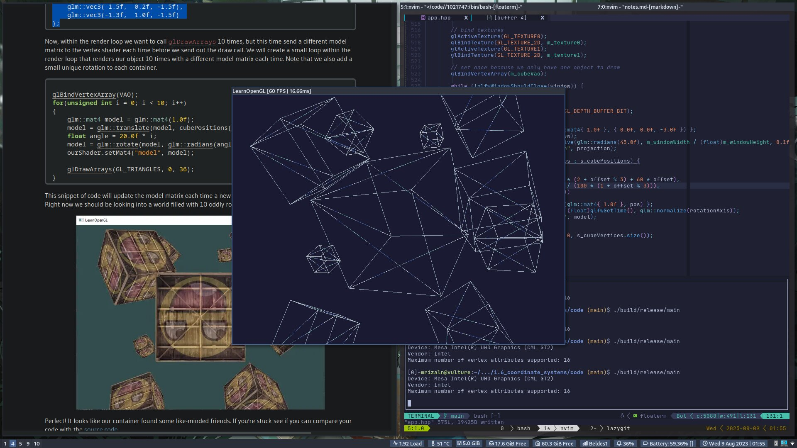

# Coordinate Systems

OpenGL expects all the vertices, that we want to become visible, to be in normalized device coordinates after each vertex shader run. What we usually do, is specify the coordinates in a range we determine ourselves and in the vertex shader transform these coordinates to normalized device coordinates (NDC). These NDC are then given to the rasterizer to transform them to 2D coordinates/pixels on your screen.

There are a total of 5 different coordinate systems that are of importance to us:

- Local space (or object space)
- World space
- View space (or Eye space)
- Clip space
- Screen space

## The global picture

```text
┏━━━━━━━━━━━━━┓                       ┏━━━━━━━━━━━━━┓                      ┏━━━━━━━━━━━━┓
┃ lOCAL SPACE ┃ ──╴[model matrix]╶──▶ ┃ WORLD SPACE ┃ ──╴[view matrix]╶──▶ ┃ VIEW SPACE ┃
┗━━━━━━━━━━━━━┛                       ┗━━━━━━━━━━━━━┛                      ┗━━━━━━━━━━━━┛
                                                                                 │
                                                                                 ╵
                                                                         [projection matrix]
                                                                                 ╷
                                                                                 │
                                                                                 ▼
                              ┏━━━━━━━━━━━━━━┓                             ┏━━━━━━━━━━━━┓
                              ┃ SCREEN SPACE ┃ ◀──╴(viewport transform)╶── ┃ CLIP SPACE ┃
                              ┗━━━━━━━━━━━━━━┛                             ┗━━━━━━━━━━━━┛
```

## Local space

Local space is the coordinate space that is local to your object, i.e. where your object begins in.

## World space

The coordinates in world space are exactly what they sound like: the coordinates of all your vertices relative to a (game) world. The coordinates of your object are transformed from local to world space; this is accomplished with the **model matrix**.

> The model matrix is a transformation matrix that translates, scales, and/or rotates your object to place it in the world at a location/orientation they belong to.

## View space (camera space or eye space)

The view space is what people usually refer to as the **camera** of OpenGL. The view space is the result of transforming your world-space coordinates to coordinates that are in front of the user's view. This is usually accomplished wit a combination or translations and rotations to translate/rotate the scene. These combined transformations are generally stored inside a **view matrix**.

## Clip space

At the end of each vertex shader run, OpenGL expects the coordinates to be within a specific range and any coordinates outside this range is **clipped** (discarded). This is also where **clip space** gets its name from.

To transform vertex coordinates from view to clip space, we define a **projection matrix** that specifies a range of coordinates e.g $-1000$ and $1000$ in each dimension. The projection matrix then converts coordinates within this specified range to NDC $(-1.0,1.0)$ (not directly, a step called _perspective division_ sits in between). With this range specified in the projection matrix, a coordinate of for example $(1250,500,700)$ won't be visible.

> Note that if only a part of a primitive e.g. a triangle is outside the **clipping volume** OpenGL will reconstruct the triangle as one or more triangles to fit inside the clipping range.

The view box (or volume) a projection matrix creates is called a **frustum** and each coordinate that ends up inside this frustum will end up on the user's screen.

Once all the vertices are transformed to clip space, a final operation called **perspective division** is performed where we divide the $x$, $y$, and $z$ components of the position vectors by the vector's homogeneous $w$ component; perspective division is what transforms the 4D clip space coordinates to 3D NDC.

It is after this stage where the resulting coordinates are mapped to screen coordinates (using the settings of `glViewPort`) and turned into fragments.

The projection matrix to transform view coordinates usually take two different forms: **orthographic** or **perspective** projection matrix.

### Orthographic projection

An orthographic projection matrix defines a cube-like frustum box that defines the clipping space. The frustum defines the visible coordinates and is specified by a width, a height, and a **near** and **far** plane.

The orthographic frustum directly maps all coordinates inside the frustum to NDC without special side effects since it won't touch the $w$ component of the transformed vector.

To create an orthographic projection, make use of GLM's built-in function `glm::ortho`

```cpp
glm::ortho(0.0f, 800.0f, 0.0f, 600.0f, 0.1f, 100.0f);
```

> 1st & 2nd param: specify the left and right coordinate of the frustum
> 3rd & 4th param: specify the bottom and top part of the frustum\
> 5th & 6th param: define the distance between the near and far plane.

### Perspective projection

The perspective projection mimics how we see things in real life. The projection matrix maps a given frustum range to clip space, but also manipulates the $w$ value of each vertex coordinate in such a way that the further away a vertex coordinate is from the viewer, the higher this $w$ component becomes. Once the coordinates are in clip space, perspective division is applied to the clip space coordinates:

$$
out = \begin{pmatrix}
x / w \\
y / w \\
z / w \\
\end{pmatrix}
$$

A perspective projection matrix can be created in GLM as follows:

```cpp
glm::mat4 proj = glm::perspective(glm::radians(45.0f), (float)width/(float)height, 0.1f, 100.0f);
```

> 1st param : defines the FOV (field of view) value.
> 2nd param : sets the aspect ratio value (view port width / height)
> 3rd and 4th param: set the near and far plane of the frustum.

## Putting it all together

We create a transformation matrix for each of the aforementioned steps: model, view, projection matrix

$$
V_{clip} = M_{projection} \cdot M_{view} \cot M_{model} \cdot V_{local}
$$

The resulting vertex should then be assigned to `gl_Position` in the vertex shader and OpenGL will then automatically perform perspective division and clipping.

> ### Right-handed system
>
> By convention, OpenGL is a Right-handed system
>
> > Huh, this kinda weird, the NDC definitely is a left-handed system though...

# Going 3D

Let's try do stuff

```cpp
glm::mat4 model{ 1.0f };
model = glm::rotate(model, glm::radians(-55.0f), { 1.0f, 0.0f, 0.0f });

glm::mat4 view{ 1.0f };
// note that we're translating the scene in the reverse direction of where we want to move
view = glm::translate(view, { 0.0f, 0.0f, -3.0f });

glm::mat4 projection{ glm::perspective(glm::radians(45.0f), 800.0f / 600.0f, 0.1f, 100.0f);}
```

Now that we created the transformation matrices, we should pass them to our shaders. First let's declare the transformation matrices as uniform in the vertex shader and multiply them with the vertex coordinates:

```glsl
#version 330 core
layout (location 0) in vec3 aPos;
...
uniform mat4 model;
uniform mat4 view;
uniform mat4 projection;

void main()
{
    // note that we read the multiplication from right to left
    gl_Position = projection * view * model * vec4(aPos, 1.0);
    ...
}
```

We should also send the matrices to the shader (usually per frame since transformation matrices tend to change a lot);

```cpp
int modelLoc = glGetUniformLocation(ourShader.ID, "model");
glUniformMatrix4fv(modelLoc, 1, GL_FALSE, glm::value_ptr(model));
... // same for View Matrix and Projection Matrix
```

# Result



