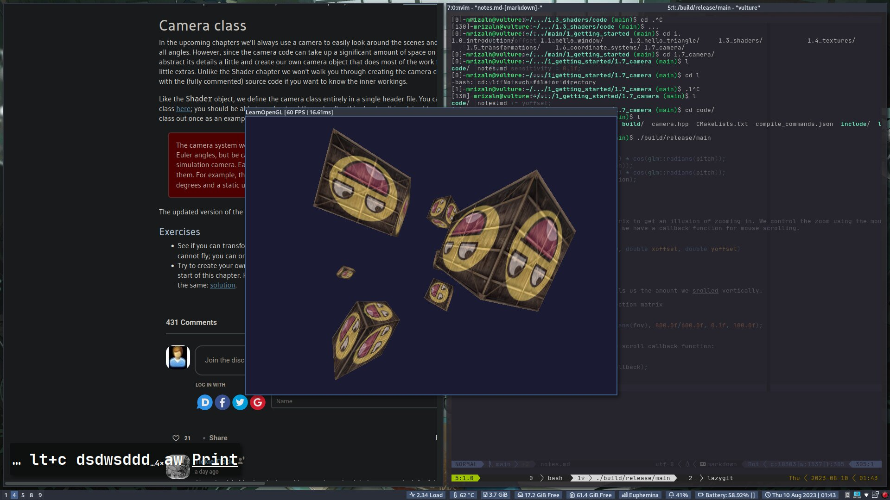
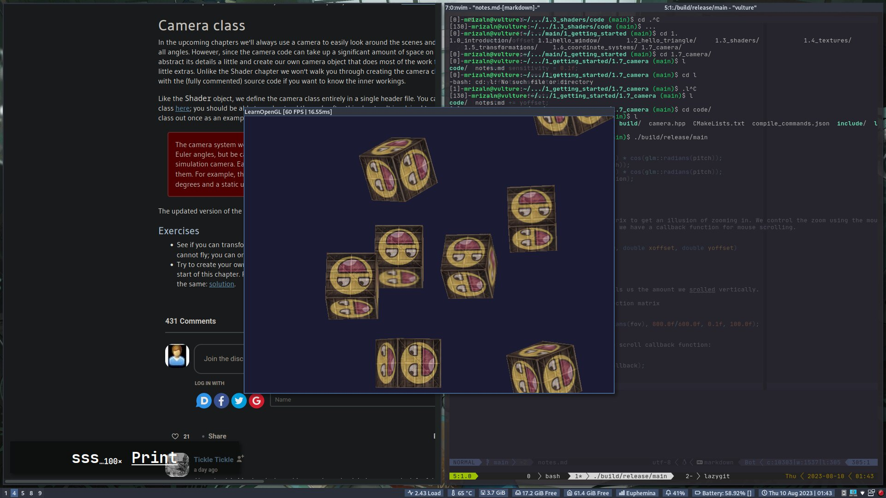
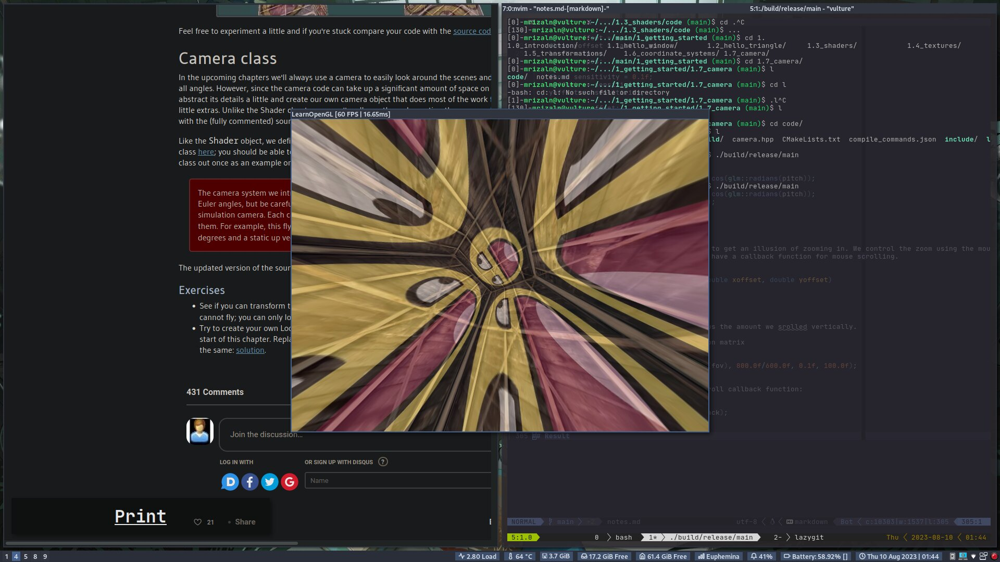

# Camera

In the previous chapter, we discussed the view matrix and how we can use the view matrix to move around the scene. OpenGL by itself is not familiar with the concept of a camera, but we can try to simulate one by moving all objects in the scene in the reverse direction, giving the illusion that we are moving.

## Camera/View space

To define a camera we need its position in world space, the direction it's looking at, a vector pointing to the right and a vector pointing upwards from the camera.

### 1. Camera position

The camera position is a vector in world space that points to the camera's position.

```cpp
glm::vec3 cameraPos{ 0.0f, 0.0f, 3.0f };
```

### 2. Camera direction

```cpp
glm::vec3 cameraTarget{ 0.0f, 0.0f, 0.0f };
glm::vec3 cameraDirection{ glm::normalize(cameraPos - cameraTarget) };
```

> The name _direction_ vector is not the best chosen name, since it is actually pointing in the reverse direction of what it is targeting.

### 3. Right axis

The _right_ vector represents the x-axis of the camera space. To get the right vector we use a little trick by first specifying an _up_ vector that points upwards in world space, then we do a cross product on the up vector and the direction vector.

```cpp
glm::vec3 worldUp{ 0.0f, 1.0f, 0.0f };
glm::vec3 cameraRight{ glm::normalize(glm::cross(up, cameraDirection)) };
```

### 4. Up axis

We can retrieve the vector that points to the camera's positive y-axis by taking the cross product of the right and direction vector

```cpp
glm::vec3 cameraUp{ glm::cross(cameraDirection, cameraRight) };
```

> The above 4 steps also known as the Gram-Schmidt process.

Using these camera vectors we can now create a **LookAt** matrix.

## LookAt

A great thing about matrices is that if you define a coordinate space using 3 perpendicular (or non-linear) axes you can create a matrix with those 3 axes plus a translation vector and you can transform any vector to that coordinate space by multiplying it with this matrix. This is what the **LookAt** matrix does.

$$
LookAt = \begin{bmatrix}
{\color{red}R_x} & {\color{red}R_y} & {\color{red}R_z} & {\color{red}0} \\
{\color{green}U_x} & {\color{green}U_y} & {\color{green}R_z} & {\color{green}0} \\
{\color{blue}D_x } & {\color{blue}D_y} & {\color{blue}D_z} & {\color{blue}0} \\
{\color{magenta}0} & {\color{magenta}0} & {\color{magenta}0} & {\color{magenta}1} \\
\end{bmatrix} \
\
\times \
\
\begin{bmatrix}
1 & 0 & 0 & -{\color{magenta}P_x} \\
0 & 1 & 0 & -{\color{magenta}P_y} \\
0 & 0 & 1 & -{\color{magenta}P_z} \\
0 & 0 & 0 & 1 \\
\end{bmatrix}
$$

Where:

- ${\color{red}R}$ is the right vector
- ${\color{green}U}$ is the up vector
- ${\color{blue}D}$ is the direction vector
- ${\color{magenta}P}$ is the camera position's vector

Note that the rotation (left matrix) and translation (right matrix) parts are inverted since we want to rotate and translate the world in the opposite direction of where we want the camera to move. The LookAt matrix does exactly what it says: it creates a view matrix that looks at a given target.

Luckily, GLM already does all this for us.

```cpp
glm::mat4 view{ glm::lookAt(
    glm::vec3{ 0.0f, 0.0f, 3.0f },      // camera position
    glm::vec3{ 0.0f, 0.0f, 0.0f },      // camera target
    glm::vec3{ 0.0f, 1.0f, 0.0f },      // world up
)};
```

## Walk around

Now we want to be able to move our camera around using user input.

First we need to set up a camera system, so it is useful to define some camera variable's at the top of our program.

```cpp
glm::vec3 cameraPos{ 0.0f, 0.0f, 3.0f };
glm::vec3 cameraFront{ 0.0f, 0.0f, -1.0f };
glm::vec3 cameraUp{ 0.0f, 1.0f, 0.0f };
```

The lookAt function now becomes

```cpp
glm::mat4 view{ glm::lookAt(cameraPos, cameraPos + cameraFront, cameraUp) };
```

The user input can be handled like this

```cpp
void processInput(GLFWwindow *window)
{
    ...
    const float cameraSpeed = 0.05f;                    // adjust accordingly
    if (glfwGetKey(window, GLFW_KEY_W) == GLFW_PRESS)
        cameraPos += cameraSpeed * cameraFront;
    if (glfwGetKey(window, GLFW_KEY_S) == GLFW_PRESS)
        cameraPos -= cameraSpeed * cameraFront;
    if (glfwGetKey(window, GLFW_KEY_A) == GLFW_PRESS)
        cameraPos -= glm::normalize(glm::cross(cameraFront, cameraUp)) * cameraSpeed;
    if (glfwGetKey(window, GLFW_KEY_D) == GLFW_PRESS)
        cameraPos += glm::normalize(glm::cross(cameraFront, cameraUp)) * cameraSpeed;
}
```

Whenever we press one of the WASD keys, the camera's position is updated accordingly.

### Movement speed

Currently we used a constant value for movement speed when walking around. This is problematic though. If the frame rate is different, the movement speed will be different as well. We need to take into account of this.

Graphics applicaitons and game usually keep track of a **deltatime** variable that stores the time it took to render the last frame. We then multiply all velocities with this `deltaTime` avalue. Doing this will fix the issue of different movement for different frame rate.

To calculate the `deltaTime` value we keep track of 2 global variables:

```cpp
float deltaTime{ 0.0f };    // time difference between current frame and last frame
float lastFrame{ 0.0f };    // time of last frame
```

Within each frame we then calculate the new `deltaTime` value for later use:

```cpp
float currentFrame{ glfwGetTime() };
deltaTime = currentFrame - lastFrame;
lastFrame = currentFrame;
```

Now that we have `deltaTime`, we can take into account when calculating the velocities:

```cpp
void processInput(GLFWwindow* window)
{
    float cameraSpeed{ 2.5f * deltaTime };
}
```

Now we will have the same speed regardless of frame rate.

## Look around

To look around the scene, we have to change the `cameraFront` vector based on the input of the mouse.

### Euler angles

Euler angles are 3 values that can represent any rotation in 3D. There are 3 Euler angles:

- **pitch**: x-axis rotation
- **yaw**: y-axis rotation
- **roll**: z-axis rotation

For our camera system, we only care about the yaw and pitch values.

```cpp
float pitch{};             // altitude (angle between xz and y; 0 when at xz)
float yaw{ -90.0f };       // azimuth (angle between x and z; 0 when at x)
glm::vec3 direction(1.0f);
auto cameraFront { glm::normalize(direction) };

void updateDirection()
{
    direction.y = sin(glm::radians(pitch));
    direction.x = cos(glm::radians(yaw)) * cos(glm::radians(pitch));
    direction.z = sin(glm::radians(yaw)) * cos(glm::radians(pitch));
    cameraFront = glm::normalize(direction);
}
```

### Mouse inputs

The yaw and pitch values are obtained from mouse (or controller/joystick) movement where horizontal mouse-movement affects the yaw and the vertical mouse-movement affetcs the pitch. The idea is to store the last frame's mouse positions and calculate in the current frame how much the mouse values changed.

First we will tell GLFW that it should hide the cursor and capture it.

```cpp
glfwSetInputMode(windo, GLFW_CURSOR, GLFW_CURSOR_DISABLED);
```

To calculate the pitch and yaw values we need to tell GLFW to listen to mouse-movement events.

```cpp
void mouse_callback(GLFWwindow* window, double xPos, double yPos);

glfwSetCursorPosCallback(window, mouse_callback);
```

When handling a mouse input for a fly style camera, there are several steps we have to take before we're able to fully calculate the camera's direction vector:

- Calculate the mouse's offset since the last frame.
- Add the offset values to the camera's yaw and pitch values.
- Add some constraints to the minimum/maximum pitch values.
- Calculate the direction vector.

```cpp
float lastX { 400 };    // center of screen
float lastY { 300 };    // center of screen
const float sensitivity { 0.1f };

void mouse_callback(GLFWwindow* window, double xPos, double yPos)
{
    // 1. calculate offset
    float xOffset { xPos - lastX };
    float yOffset { yPos - lastY };

    lastX = xPos;
    lastY = yPos;

    xOffset *= sensitivity;
    yOffset *= sensitivity;

    // 2. add last offset
    camera::yaw   += xOffset;
    camera::pitch += yOffset;

    // 3. constraints
    if (camera::pitch >  89.0f) camera::pitch =  89.0f;
    if (camera::pitch < -89.0f) camera::pitch = -89.0f;

    // 4. calculate the direction vector
    camera::updateDirection();
}
```

If you'd now run the code, you'll notice the camera makes a large sudden jump whenever the window first receives focus of your mouse cursor. THe cause for this sudden jump is that as soon as your cursor enters the window, the mouse callback function is called with an `xPos` and `yPos` position equal to the location of your mouse entered the screen from.
We can fix this issue by defining a global `bool` variable to check if this is the first time we receive mouse input.

```cpp
void mouse_callback(GLFWwindow* window, double xpos, double ypos)
{
    if (firstMouse)       // initially set to true
    {
        lastX = xpos;
        lastY = ypos;
        firstMouse = false;
    }

    float xoffset = xpos - lastX;
    float yoffset = lastY - ypos;
    lastX = xpos;
    lastY = ypos;

    float sensitivity = 0.1f;
    xoffset *= sensitivity;
    yoffset *= sensitivity;

    yaw   += xoffset;
    pitch += yoffset;

    if(pitch > 89.0f)
        pitch = 89.0f;
    if(pitch < -89.0f)
        pitch = -89.0f;

    glm::vec3 direction;
    direction.x = cos(glm::radians(yaw)) * cos(glm::radians(pitch));
    direction.y = sin(glm::radians(pitch));
    direction.z = sin(glm::radians(yaw)) * cos(glm::radians(pitch));
    cameraFront = glm::normalize(direction);
}
```

### Zoom

We can change the FOV of projection matrix to get an illusion of zooming in. We control the zoom using the mouse's wheel. Similar to mouse movement, we have a callback function for mouse scrolling.

```cpp
void scroll_callback(GLFWwindow* window, double xoffset, double yoffset)
{
    fov -= (float)yoffset;
}
```

When scrolling, the `yoffset` value tells us the amount we srolled vertically.

After this, we need to update the projection matrix

```cpp
projection = glm::perspective(glm::radians(fov), 800.0f/600.0f, 0.1f, 100.0f);
```

And lastly don't forget to register the scroll callback function:

```cpp
glfwSetScrollCallback(window, scroll_callback);
```

## Result




