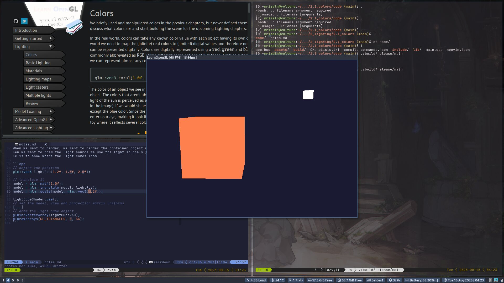

# Colors

In the real world, colors can take any known color value with each object having its own color(s). In the digital world we need to map the (infinite) real colors to (limited) digital values and therefore not all real-world colors can be represented digitally. Colors are digital represented using a red, green, and blue component (RGB). Using just those 3 values, within range of [0, 1], we can represent almost any color there is.

The color of an object we see in real life is not the color it actually has, but is the color reflected from the object. The color from a light source is all absorbed except the color that we perceive.

These rules of color reflection apply directly in graphics-land (kinda). When we define a light source in OpenGL we want to give this light source a color. We'll give the light source a white color. If we would then multiply the light source's color with an object's color value, the resulting color would be the reflected color of the object.

```cpp
glm::vec3 lightColor{ 1.0f, 1.0f, 1.0f };
glm::vec3 toyColor{ 1.0f, 0.5f, 0.31f };
auto result{ lightColor * toyColor };     // == (1.0f, 0.5f, 0.31f)
```

## A lighting scene

The first thing we need is an object to cast the light on and we'll use the container cube from previous chapters. We'll also be needing a light object to show where the light source is located in the 3D scene (for simplicity sake, we'll use a cube as well).

So the first thing we'll need is a vertex shader to draw the container. The vertex positions of the container remain the same (although we won't be needing texture coordinates this time).

> vertex shader

```glsl
#version 330 core
layout (location = 0) in vec3 aPos;

uniform mat4 model;
uniform mat4 view;
uniform mat4 projection;

void main()
{
    gl_Position = projection * view * model * vec4(aPos, 1.0);
}
```

Because we're also going to render a light source cuve, we want to generate a new VAO specifically for the light source. We could render the light source with the same VAO and then do a few light position transformations on the model matrix, but in the upcoming chapters we'll be changing the vertex data and attribute pointers of the container object quite often and we do not want these changes to propagate to the light source object, so we'll create new VAO.

```cpp
unsigned int lightVAO;
glGenVertexArrays(1, &lightVAO);
glBindVertexArray(lightVAO);
// we only need to bind to the VBO, the container's VBO's data already contains the data.
glBindBuffer(GL_ARRAY_BUFFER, VBO);
// set the vertex attribute
glVertexAttribPointer(0, 3, GL_FLOAT, GL_FALSE, 3 * sizeof(float), (void*)0);
glEnableVertexAttribArray(0);
```

There is one thing left to define and that is the fragment shader for both the container and the light source.

```glsl
#version 330 core
out vec4 FragColor;

uniform vec3 objectColor;
uniform vec3 lightColor;

void main()
{
    FragColor = vec4(lightColor * objectColor, 1.0);
}
```

The fragment shader accepts both an object color and light color from a uniform variable. Here, we multiply the light's color with the object's (reflected) color like we discussed. Let's set the object's color and the light color

```cpp
lightingShader.use();
lightingShader.setVec3("objectColor", 1.0f, 0.5f, 0.31f);
lightingShader.setVec3("lightColor",  1.0f, 1.0f, 1.0f);
```

One thing left to note is that when we start to update these /lighting shaders/ in the next chapters, the light source cube would also be affected and this is not what we want. We want the light source to have a constant bright color, unaffected by other color changes.

To accomplish this, we need to create a second set of shaders that we'll use to draw the light source cube, thus beng safe from any changes from the lighting shaders. The vertex shader is the same as the lighting shader so you can simply copy the source code over. The fragment shader of the light source cube ensures the cube's color remains bright by defining a constant white color on the lamp.

```glsl
#version 330 core
out vec4 FragColor;

void main()
{
    FragColor = vec4(1.0); // set all 4 vector values to 1.0
}
```

When we want to render, we want to render the container object using the lighting shader we just defined, and when we want to draw the light source we use the light source's shaders. The main purpose of the light source cube is to show where the light comes from.

```cpp
// define the position
glm::vec3 lightPos(1.2f, 1.0f, 2.0f);

// translate it
model = glm::mat4(1.0f);
model = glm::translate(model, lightPos);
model = glm::scale(model, glm::vec3(0.2f));

lightCubeShader.use();
// set the model, view and projection matrix uniforms
[...]
// draw the light cube object
glBindVertexArray(lightCubeVAO);
glDrawArrays(GL_TRIANGLES, 0, 36);
```

## Result


