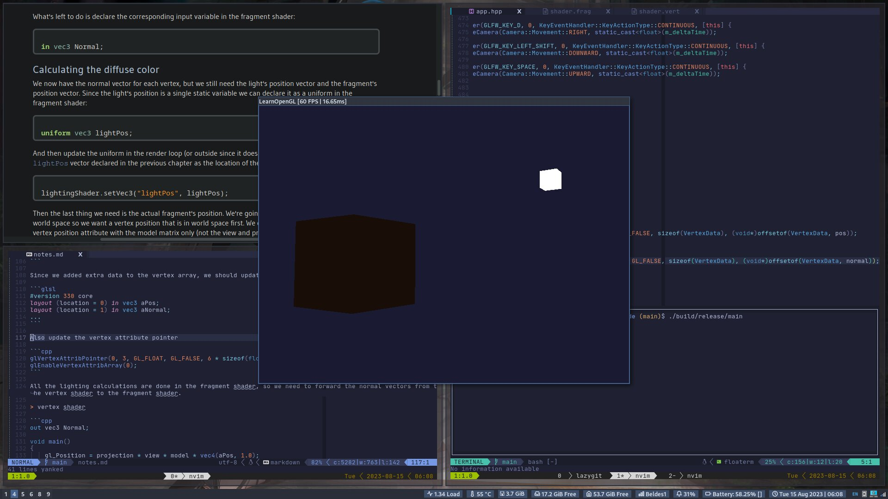
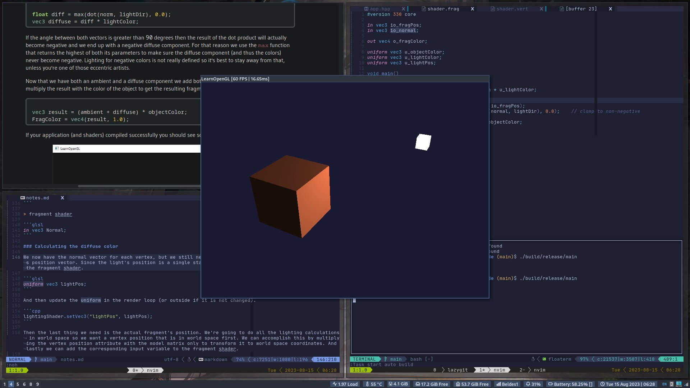
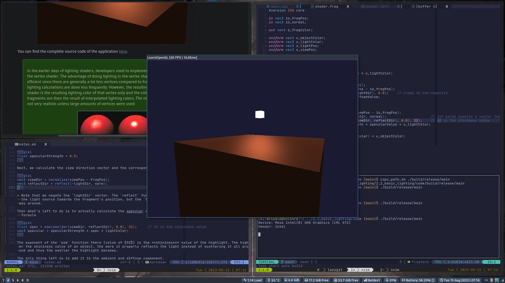

# Basic Lighting

Lighting in OpengGL is based on approximations of reality using simplified models that are much easier to process and look relatively similar. The lighting models are based on physics of light as we understand it. One of these models is called the **`Phong lighting model`**

The major building blocks of the Phong lighting model consists of 3 components:

- Ambient lighting
- Diffuse lighting
- Specular lighting

## Ambient lighting

Light bounce and scatter in many directions, reaching spots that aren't immediately visible; light can thus reflect on other surfaces and have an indirect impact on the lighing of an object. Algorithms that take this into account are called **global illumination algorithm**.

A very simplistic model of global illumination is named **ambient lighting**.

Adding ambient lighting to the scene is really easy. We take the light's color, multiply it with a small constant ambient factor, multiply this with the object's color, and use that as the fragment's color in the cube object's shader.

```glsl
void main()
{
    float ambientStrength = 0.1;
    vec3 ambient = ambientStrength * lightColor;

    vec3 result = ambient * objectColor;
    FragColor = vec4(result, 1.0);
}
```

## Diffuse lighting

Diffuse lighting gives the object more brightness the closer its fragments are aligned to the rays from a light source.

> this drawing will look good if displayed with 0 vertical spacing

```text
     [light]
        ╲     △
         ╲    │
          ╲   │
           ╲  │ n⃗ (surface normal)
            ╲θ│
             ╲│
┌────────────────────────────┐
│        [ object ]          │
```

We need to measure at what angle the light ray touches the fragment. If the light ray is perpendicular to the object's surface, the light has the greatest impact. To measure the angle between the light ray and the fragment, we use a **normal vector**, that is a vector perpendicular to the fragment's surface. The angle between the two vectors can then easily be calculated with the dot product (between the normalized vectors).

So what do we need to calculate diffuse lighting:

- Normal vector
- The directed light ray

### Normal vectors

A normal vector is a unit vector that is perpendicular to the surface of a vertex. Since a vertex by itself has no surface we retrieve a normal vector by using its surrounding vertices to figure out the surface of the vertex.

We can use a little trick to calculate the normal vectors for all the cube's vertices by using the cross product, but since a 3D cube is not complicated, we can simply manually add them to the vertex data.

```cpp
loat vertices[] = {
    // vertex position          vertex normal
    -0.5f, -0.5f, -0.5f,        0.0f,  0.0f, -1.0f,
     0.5f, -0.5f, -0.5f,        0.0f,  0.0f, -1.0f,
     0.5f,  0.5f, -0.5f,        0.0f,  0.0f, -1.0f,
     0.5f,  0.5f, -0.5f,        0.0f,  0.0f, -1.0f,
    -0.5f,  0.5f, -0.5f,        0.0f,  0.0f, -1.0f,
    -0.5f, -0.5f, -0.5f,        0.0f,  0.0f, -1.0f,

    -0.5f, -0.5f,  0.5f,        0.0f,  0.0f, 1.0f,
     0.5f, -0.5f,  0.5f,        0.0f,  0.0f, 1.0f,
     0.5f,  0.5f,  0.5f,        0.0f,  0.0f, 1.0f,
     0.5f,  0.5f,  0.5f,        0.0f,  0.0f, 1.0f,
    -0.5f,  0.5f,  0.5f,        0.0f,  0.0f, 1.0f,
    -0.5f, -0.5f,  0.5f,        0.0f,  0.0f, 1.0f,

    -0.5f,  0.5f,  0.5f,       -1.0f,  0.0f,  0.0f,
    -0.5f,  0.5f, -0.5f,       -1.0f,  0.0f,  0.0f,
    -0.5f, -0.5f, -0.5f,       -1.0f,  0.0f,  0.0f,
    -0.5f, -0.5f, -0.5f,       -1.0f,  0.0f,  0.0f,
    -0.5f, -0.5f,  0.5f,       -1.0f,  0.0f,  0.0f,
    -0.5f,  0.5f,  0.5f,       -1.0f,  0.0f,  0.0f,

     0.5f,  0.5f,  0.5f,        1.0f,  0.0f,  0.0f,
     0.5f,  0.5f, -0.5f,        1.0f,  0.0f,  0.0f,
     0.5f, -0.5f, -0.5f,        1.0f,  0.0f,  0.0f,
     0.5f, -0.5f, -0.5f,        1.0f,  0.0f,  0.0f,
     0.5f, -0.5f,  0.5f,        1.0f,  0.0f,  0.0f,
     0.5f,  0.5f,  0.5f,        1.0f,  0.0f,  0.0f,

    -0.5f, -0.5f, -0.5f,        0.0f, -1.0f,  0.0f,
     0.5f, -0.5f, -0.5f,        0.0f, -1.0f,  0.0f,
     0.5f, -0.5f,  0.5f,        0.0f, -1.0f,  0.0f,
     0.5f, -0.5f,  0.5f,        0.0f, -1.0f,  0.0f,
    -0.5f, -0.5f,  0.5f,        0.0f, -1.0f,  0.0f,
    -0.5f, -0.5f, -0.5f,        0.0f, -1.0f,  0.0f,

    -0.5f,  0.5f, -0.5f,        0.0f,  1.0f,  0.0f,
     0.5f,  0.5f, -0.5f,        0.0f,  1.0f,  0.0f,
     0.5f,  0.5f,  0.5f,        0.0f,  1.0f,  0.0f,
     0.5f,  0.5f,  0.5f,        0.0f,  1.0f,  0.0f,
    -0.5f,  0.5f,  0.5f,        0.0f,  1.0f,  0.0f,
    -0.5f,  0.5f, -0.5f,        0.0f,  1.0f,  0.0f
};
```

Since we added extra data to the vertex array, we should update the cube's vertex shader.

```glsl
#version 330 core
layout (location = 0) in vec3 aPos;
layout (location = 1) in vec3 aNormal;
...
```

Also update the vertex attribute pointer

```cpp
glVertexAttribPointer(0, 3, GL_FLOAT, GL_FALSE, 6 * sizeof(float), (void*)0);
glEnableVertexAttribArray(0);
```

All the lighting calculations are done in the fragment shader, so we need to forward the normal vectors from the vertex shader to the fragment shader.

> vertex shader

```cpp
out vec3 Normal;

void main()
{
    gl_Position = projection * view * model * vec4(aPos, 1.0);
    Normal = aNormal;
}
```

> fragment shader

```glsl
in vec3 Normal;
```

### Calculating the diffuse color

We now have the normal vector for each vertex, but we still need the light's position vector and the fragment's position vector. Since the light's position is a single static variable, we can declare it as a uniform in the fragment shader.

```glsl
uniform vec3 lightPos;
```

And then update the uniform in the render loop (or outside if it is not changed).

```cpp
lightingShader.setVec3("lightPos", lightPos);
```

Then the last thing we need is the actual fragment's position. We're going to do all the lighting calculations in world space so we want a vertex position that is in world space first. We can accomplish this by multiplying the vertex position attribute with the model matrix only to transform it to world space coordinates. And lastly we can add the corresponding input variable to the fragment shader.

> vertex shader

```glsl
out vec3 FragPos;
out vec3 Normal;

void main()
{
    gl_Position = projection * view * model * vec4(aPos, 1.0);
    FragPos = vec3(model * vec4(aPos, 1.0));
    Normal = aNormal;
}
```

> fragment shader

```glsl
in vec3 FragPos;
```

Now the calculation part.

The first thing we need to calculate is the direction vector between the light source and the fragment's position. Next, we need to calculate the diffuse impact of the light on the current fragment by taking the dot product between the **normal** and **lightDir** vectors. The resulting value is then multiplied with the light's color to get the diffuse component. Last add both the ambient and diffuse color to the resultant fragment color.

```glsl
// normalize just in case
vec3 norm = normalize(Normal);
vec3 lightDir = normalize(lightPos - FragPos);

// calculate diffuse
float diff = max(dot(norm, lightDir), 0.0);   // clamp the value to non-negative
vec3 diffuse = diff * lightColor;

// add the resulting diffuse with ambient
vec3 result = (ambient + diffuse) * objectColor;
FragColor = vec4(result, 1.0);
```

### One last thing

In the previous section, we passed the normal vector directly from the vertex shader to the fragment shader. However calculations in the fragment shader are all done in world space, so shouldn't we transform the normal vectors to world space coordinates as well? - basically yes, but it's not as simple as simply multiplying it with a model matrix.

First of all, normal vectors are only direction vectors and do not represent a specific position in space. So it means, translation shouldn't have any effect on the normal vectors.

Second, if the model matrix would perform a non-uniform scale, the vertices would be changed in such a way that the normal vector is not perpendicular to the surface anymore.

The trick of fixing this behavior is to use a different model matrix specifically tailored for normal vectors. This matrix is called the **normal matrix** and uses a few linear algebraic operations to remove the effect of wrongly scaling the normal vectors.

The normal matrix is defined as: "_the transpose of the inverse of the upper 3x3 part of the model matrix_" (upper 3x3: scaling part only).

> Note that most resources define the normal matrix derived from the model-view matrix but since we're working in world space, we will derived it from the model matrix.

On the vertex shader we can generate the normal matrix by using the inverse and transpose functions in the vertex shader that work on any matrix type. Note that we cast the matrix to a 3x3 matrix to ensure it loses its translation properties.

```glsl
Normal = mat3(transpose(inverse(model))) * aNormal;
```

> Inversing matrices is costly operation for shader, so wherever possible try to avoid inverse operations since they have to be done on each vertex on your screen. You'll likely want to calculate the normal matrix on the CPU and send it to the shaders via a uniform before drawing.

## Specular lighting

Similar to diffuse lighting, specular lighting is based on the object's direction vector and the object's normal vectors, but this time, it is also based on the view direction. Specular lighting is based on the reflective properties of surfaces.

We calculate a reflection vector by reflecting the light direction around the normal vector. Then we calculate the angular distance between this reflection vector and the view direction. The resulting effect is that we see a bit of a highlight when we're looking at the light's direction reflected via the surface.

The view vector is the one extra variable we need for specular lighting which we can calculate using the view's world space position and the fragment's position. Then we calculate the specular's intensity, multiply this with the light color and add this to the ambient and diffuse components.

> We chose to do the lighting calculation in world space, but most people tend to prefer doing lighting in view space. An advantage of view space is that the viewer's position is always at $(0,0,0)$ so you already got the position of the viewer for free. If you still want to calculate lighting in view space, you want to transform all the relevant vectors with the view matrix as well (don't forget to change the normal matrix too).

To get the world space coordinates of the viewer we simply take the position vector of the camera object. So let's add another uniform to the fragment shader.

```glsl
uniform vec3 viewPos;
```

```cpp
lightingShader.setVec3("viewPos", camera.Position);
```

Now we can calculate the specular intensity.

First we define a specular intensity value to give the specular highlight a medium-bright color.

```glsl
float specularStrength = 0.5;
```

Next, we calculate the view direction vector and the corresponding reflect vector along the normal axis.

```glsl
vec3 viewDir = normalize(viewPos - FragPos);
vec3 reflectDir = reflect(-lightDir, norm);
```

> Note that we negate the `lightDir` vector. The `reflect` function expects the first vector to point **from** the light source towards the fragment's position, but the `lightDir` vector is currently pointing the other way around.

Then what's left to do is to actually calculate the specular component. This is accomplised with the following formula

```glsl
float spec = pow(max(dor(viewDir, reflectDir), 0.0), 32);     // 32 is the shininess value
vec3 specular = specularStrength * spec * lightColor;
```

The exponent of the `pow` function there (value of $32$) is the **shininess** value of the highlight. The higher the shininess value of an object, the more it properly reflects the light instead of scattering it all around and thus the smaller the highlight becomes.

The only thing left is to add it to the ambient and diffuse component.

```glsl
vec3 result = (ambient + diffuse + specular) * objectColor;
FragColor = vec4(result, 1.0);
```

## Result




