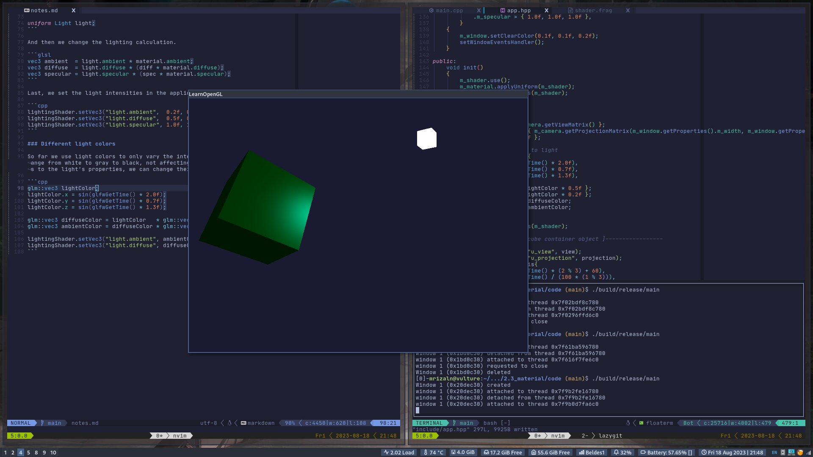

# Materials

In the real world, each object has a different reaction to light. Steel objects are often shinier than a clay vase for example and a wooden container does not react the same to light as a steel container. If we want to simulate several types of objects in OpenGL, we have to define **`material`** properties specific to each surface.

When describing a surface we can define a `material` color for each of the 3 lighting component: ambient, diffuse, and specular lighting. By specifying a color for each of the components we have fine-grained control over the color output of the surface. Now add shininess component to those 3 colors and we have all the `material` properties we need.

In the fragment shader we create a struct to store the `material` properties of the surface.

```glsl
#version 330 core
struct Material {
    vec3 ambient;
    vec3 diffuse;
    vec3 specular;
    float shininess;
};

uniform Material material;
```

With these 4 components that define an object's material, we can simulate many real-world materials. A table as found at [https://devernay.free.fr] shows a list of material properties that simulate real material found in the outside world.

## Setting materials

We have created a uniform `material` struct in the fragment shader, so next we want to change the lighting calculations to comply with the new material properties.

```glsl
void main()
{
    // ambient
    vec3 ambient = lightColor * material.ambient;

    // diffuse
    vec3 norm = normalize(Normal);
    vec3 lightDir = normalize(lightPos - FragPos);
    float diff = max(dot(norm, lightDir), 0.0);
    vec3 diffuse = lightColor * (diff * material.diffuse);

    // specular
    vec3 viewDir = normalize(viewPos - FragPos);
    vec3 reflectDir = reflect(-lightDir, norm);
    float spec = pow(max(dot(viewDir, reflectDir), 0.0), material.shininess);
    vec3 specular = lightColor * (spec * material.specular);

    vec3 result = ambient + diffuse + specular;
    FragColor = vec4(result, 1.0);
}
```

We can set the `material` of the object in the application by setting the appropiate uniform. A `struct` in GLSL however is not special in any regard when setting uniforms; a `struct` only really acts as a `namespace` of uniform variables. If we want to fill the `struct`, we will have to set the individual uniforms, but prefixed with the `struct`'s name:

```cpp
lightingShader.setVec3("material.ambient", 1.0f, 0.5f, 0.31f);
lightingShader.setVec3("material.diffuse", 1.0f, 0.5f, 0.31f);
lightingShader.setVec3("material.specular", 0.5f, 0.5f, 0.5f);
lightingShader.setFloat("material.shininess", 32.0f);
```

### Light properties

Light sources have different intensities for their ambient, diffuse, and specular components respectively. In the previous chapter, we solved this by varying the ambient and specular intensities with a strength value. We want to do something similar, but this time by specifying intensity vectors for each of the lighting components.

We'll want to create something similar to the material struct for the light properties.

```glsl
struct Light {
    vec3 position;

    vec3 ambient;
    vec3 diffuse;
    vec3 specular;
};

uniform Light light;
```

And then we change the lighting calculation.

```glsl
vec3 ambient  = light.ambient * material.ambient;
vec3 diffuse  = light.diffuse * (diff * material.diffuse);
vec3 specular = light.specular * (spec * material.specular);
```

Last, we set the light intensities in the application

```cpp
lightingShader.setVec3("light.ambient",  0.2f, 0.2f, 0.2f);
lightingShader.setVec3("light.diffuse",  0.5f, 0.5f, 0.5f); // darken diffuse light a bit
lightingShader.setVec3("light.specular", 1.0f, 1.0f, 1.0f);
```

### Different light colors

So far we use light colors to only vary the intensity of their individual components by choosing colors that range from white to gray to black, not affecting the actual colors of the object. Since we now have easy access to the light's properties, we can change their colors over time to get some really interesting effects.

```cpp
glm::vec3 lightColor;
lightColor.x = sin(glfwGetTime() * 2.0f);
lightColor.y = sin(glfwGetTime() * 0.7f);
lightColor.z = sin(glfwGetTime() * 1.3f);

glm::vec3 diffuseColor = lightColor   * glm::vec3(0.5f);
glm::vec3 ambientColor = diffuseColor * glm::vec3(0.2f);

lightingShader.setVec3("light.ambient", ambientColor);
lightingShader.setVec3("light.diffuse", diffuseColor);
```

## Result


