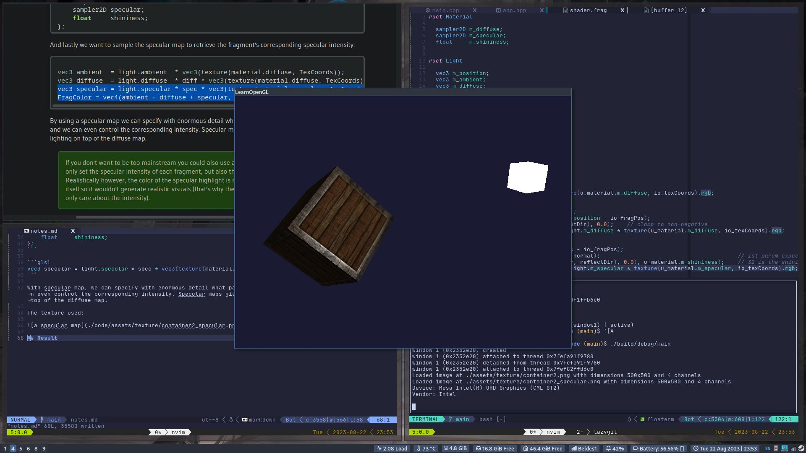
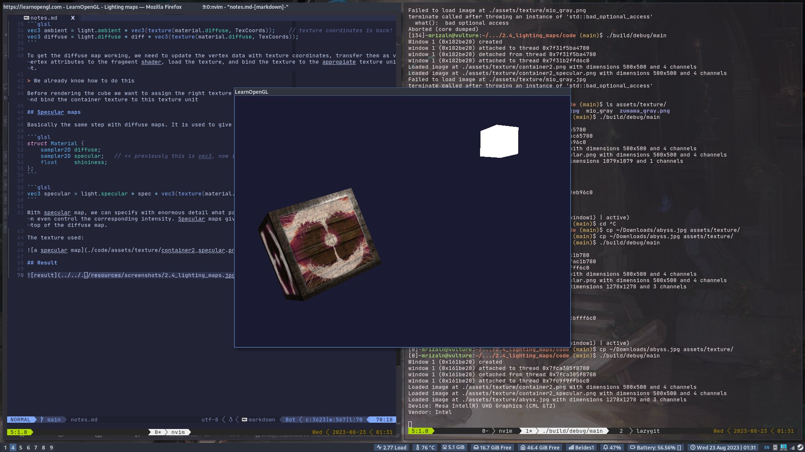

# Lighting Maps

In the previous chapter we defined a material for an entire object as a whole. Objects in real world however usually do not consist of a single material, but of several materials.

Think of a car: its exterior consists of a shiny fabric, it has windows that partly reflect the surrounding environment, its tires are all but shiny so they don't have specular highlights and it has rims that are super shiny. All in all, such an object has different material properties for each of its different parts.

So the material system in the previous chapter isn't sufficient for all but the simplest models so we need to extend the system by introducing **diffuse** and **specular** maps.

## Diffuse maps

What we want is some way to set the diffuse colors of an object for each individual fragment. We're just using a different name for the same undelying principle: using an image wrapped around an object that we can index for unique color values per fragment. In lit scenes this is usually called a [diffuse map]

To demonstrate diffuse maps, we're going to use the following image:


Using a diffuse map in shaders is exactly like we showed in the texture chapter. This time however we store the texture as a sampler2D inside the Material struct.

> keep in mind that sampler2D is a so called **_opaque type_** which means we can't instantiate these types, but only define them as uniforms. If the struct would be instantiated other than as a uniform (like a function parameter), GLSL could throw strange errors; the same thus applies to any struct holding such opaque types.

We also remove the ambient material color vector since the ambient color is equal to the diffuse color anyway.

```glsl
struct Material {
    sampler2D diffuse;
    vec3      specular;
    float     shininess;
};
...
in vec2 TexCoords;
```

Note that we are going to need texture coordinates again in the fragment shader, so we declared an extra input variable. Then we simply sample from the texture to retrieve the fragment's diffuse color value. Also don't forget to set the ambient material's color equal to the diffuse material's color as well.

```glsl
vec3 ambient = light.ambient * vec3(texture(material.diffuse, TexCoords));    // texture coordinates is back!
vec3 diffuse = light.diffuse * diff * vec3(texture(material.diffuse, TexCoords));
```

To get the diffuse map working, we need to update the vertex data with texture coordinates, transfer them as vertex attributes to the fragment shader, load the texture, and bind the texture to the appropiate texture unit.

> We already know how to do this

Before rendering the cube we want to assign the right texture unit to the `material.diffuse` uniform sampler and bind the container texture to this texture unit

## Specular maps

Basically the same step with diffuse maps. It is used to give an object a different specular on its parts.

```glsl
struct Material {
    sampler2D diffuse;
    sampler2D specular;   // << previously this is vec3, now it's a sampler2D
    float     shininess;
};
```

```glsl
vec3 specular = light.specular * spec * vec3(texture(material.specular, TexCoords));
```

With specular map, we can specify with enormous detail what parts of an object have shiny properties and we can even control the corresponding intensity. Specular maps give us an added layer of control over lighting on top of the diffuse map.

The texture used:


## Result



