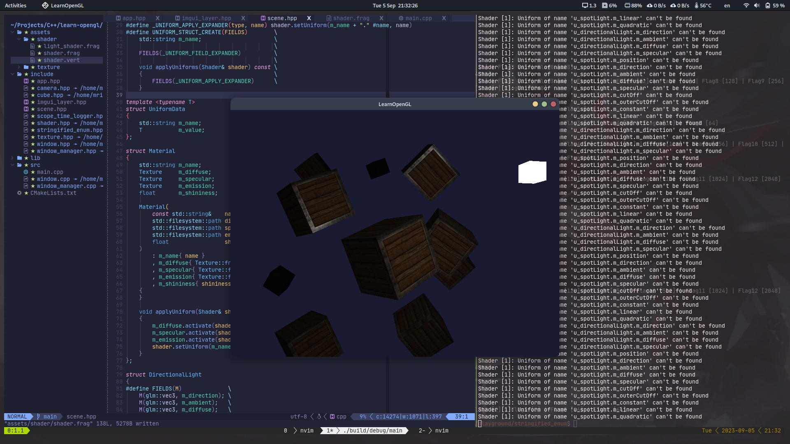

# Light Casters

In real world, we have several types of light that each act different. A light source that _casts_ light upon object is called a **light caster**. In this chapter we'll discuss several different types of light casters.

## Directional light

When a light source is far away, the light rays coming from the light source are close to parallel to each other. It looks like all the light rays are coming from the same direction, regardless of where the object and/or the viewer is. When a light source is modeled to be _infinitely_ far away, it is called a **directional light** since all its light rays have the same direction.

We can model such a directional light by defining a light direction vector instead of a position vector. The shader calculations remain mostly the same except this time we directly use the light's direction vector instead calculating the **`lightDir`** vector using the lights position vector.

> fragment shader

```glsl
struct DirectionalLight {
    // vec3 position;    // no longer necessary when using directional lights.
    vec3 direction;       // direction from light source to fragment
    vec3 ambient;
    vec3 diffuse;
    vec3 specular
};

// ...

void main()
{
    vec3 lightDir = normalize(-light.direction);    // direction from fragment to light source
}
```

The directional light direction generally specified as a global direction pointing from the light source.

To clearly demonstrate that a directional light has the same effect on multiple objects, we revisit the container party scene from the end of the [Coordinate systems](../../1_getting_started/1.6_coordinate_systems/notes.md) chapter

```cpp
static constexpr std::array<glm::vec3, 10> s_cubePositions{ {
    // clang-format off
    {  0.0f,  0.0f,  0.0f },
    {  2.0f,  5.0f, -15.0f},
    { -1.5f, -2.2f, -2.5f },
    { -3.8f, -2.0f, -12.3f},
    {  2.4f, -0.4f, -3.5f },
    { -1.7f,  3.0f, -7.5f },
    {  1.3f, -2.0f, -2.5f },
    {  1.5f,  2.0f, -2.5f },
    {  1.5f,  0.2f, -1.5f },
    { -1.3f,  1.0f, -1.5f },
    // clang-format on
} };

// ...

for (std::size_t i{ 0 }; i < s_cubePositions.size(); ++i) {
    glm::mat4 model = glm::mat4(1.0f);
    model = glm::translate(model, cubePositions[i]);
    float angle = 20.0f * i;
    model = glm::rotate(model, glm::radians(angle), glm::vec3(1.0f, 0.3f, 0.5f));
    lightingShader.setMat4("model", model);

    glDrawArrays(GL_TRIANGLES, 0, 36);
}
```

Don't forget to actually specify the direction of the light source (note that we define the direction as a direction from the light source).

```cpp
lightingShader.setVec3("light.direction", -0.2f, -1.0f, -0.3f);
```

> We've been passing the light's position and direction vectors as `vec3` for a while now, but some people prefer to keep all the vectors defined as `vec4`. When defining position vectors as a `vec4` it is important to set the w component to $1.0$ so translations and projections are properly applied. However, when defining a direction vector as a `vec4` we don't want translations to have an effect so then we define the w component to be $0.0$.

> This trick above can function as an easy check for light types: you could check if the w component is equal to $1.0$ to see that we now have a light's position vector and if w is equal to $0.0$ we have a light's direction vector.

## Point lights

A point light is a light source with a given position somewhere in a world that illuminates in all directions, where the light rays fade out over distance. In the earlier chapters we've been working with a simplistic point light. We had a light source at a given position that scatters light in all directions that that never fades out.

### Attenuation

To reduce the intensity of light over the distance a light ray travels is generally called **attenuation**.
In the real world, lights intensity are decreasing quadratically. The following formula calculates an attenuation value based on a fragment's distance
to the light source

$F = \dfrac { 1.0 } { K_c + K_l \cdot d + K_q \cdot d^2 }$

<br> $d$ = distance from the fragment to the light source
<br> $K_c$ = constant term(kept at 1.0)
<br> $K_l$ = linear term
<br> $K_q$ = quadratic term

### Choosing the right values

Setting the right values depend on many factors: the environment, the distance you want a light to cover, the type of light, etc. In most cases, it simply is a question of experience and a moderate amount of tweaking.

The following table shows some of the values these terms could take to simulate a realistic (sort of) light source that covers a specific radius

| distance | constant | linear | quadratic |
| -------- | -------- | ------ | --------- |
| 7        | 1.0      | 0.7    | 1.8       |
| 13       | 1.0      | 0.35   | 0.44      |
| 20       | 1.0      | 0.22   | 0.20      |
| 32       | 1.0      | 0.14   | 0.07      |
| 50       | 1.0      | 0.09   | 0.032     |
| 65       | 1.0      | 0.07   | 0.017     |
| 100      | 1.0      | 0.045  | 0.0075    |
| 160      | 1.0      | 0.027  | 0.0028    |
| 200      | 1.0      | 0.022  | 0.0019    |
| 325      | 1.0      | 0.014  | 0.0007    |
| 600      | 1.0      | 0.007  | 0.0002    |
| 3250     | 1.0      | 0.0014 | 0.000007  |

> source: http://www.ogre3d.org/tikiwiki/tiki-index.php?page=-Point+Light+Attenuation

### Implementing attenuation

To implement attenuation we'll be needing 3 extra values in the fragment shader: namely the constant, linear, and quadratic term of the equation. These are best stored in the `Light` struct we defined earlier. Note that we need to calculate lightDir again using position as this is a point light.

```glsl
struct PointLight {
    vec3 position;

    vec3 ambient;
    vec3 diffuse;
    vec3 specular;

    float constant;
    float linear;
    float quadratic;
};
```

Then we set the terms in our application

```cpp
lightingShader.setFloat("light.constant", 1.0f);
lightingShader.setFloat("light.linear", 0.09f);
lightingShader.setFloat("light.quadratic", 0.032f);
```

Implementing attenuation in the fragment shader is relatively straightforward: simply calculate an attenuation value based on the equation and multiply this with the ambient, diffuse and specular components.

```glsl
float distance    = length(light.position - FragPos);
float attenuation = 1.0 / (light.constant + light.linear * distance + light.quadratic * (distance * distance));
```

## Spotlight

A spotlight is a light source that is located somewhere in the environment that, instead of shooting light rays in all directions, only shoots them in a specific direction. The result is that only the objects within a certain radius of the spotlight's direction are lit and everything else stays dark.

A spotlight in OpenGL is represented by a world-space position, a direction and a _cutoff_ angle that specifies the radius of the spotlight. For each fragment we calculate if the fragment is between the spotlight's cutoff directions and if so, we lit the fragment accordingly.

```text

                        [light]                     lightDir: the vector pointing from the fragment to the light source
                         / | \                      spotDir : the direction the spotlight is aiming at
                        /  |  \                     ϕ       : the cutoff angle
                       / ϕ |   \                    θ       : the angle between lightDir and spotDir
                      /    |    \
                     /     ↓     \
                    /    spotDir  \
            ---------■---------------------
            |     / fragment        \     |
            |    /                   \    |
            |   /                     \   |
```

So what we basically need to do, is calculate the dot product between the lightDir vector and the spotDir vector and compare this with the cutoff angle.

### Flashlight

A flashlight is a spotlight located at the viewer's position and usually aimed straight ahead from the player's perspective. A flashlight is basically a normal spotlight, but with its position and direction continually updated based on the player's position and orientation.

So the values we're going to need for the fragment shader are the spotlight's position vector, the spotlight's direction vector and the cutoff angle. We can store these values in the `Light` struct.

```glsl
struct Light {
    vec3 position;
    vec3 direction;   // direction from light source
    float cutOff;
    ...
}
```

Next we pass the appropriate values to the shader

```cpp
lightingShader.setVec3("light.position",  camera.Position);
lightingShader.setVec3("light.direction", camera.Front);
lightingShader.setFloat("light.cutOff",   glm::cos(glm::radians(12.5f)));
```

Now what's left to do is calculate the theta θ value and compare this with the cutoff ϕ value to determine if we're in or outside the spotlight

```glsl
float theta = dot(lightDir, normalize(-light.direction));   // negated, direction towards light source

if (theta > light.cutOff) {
    // do lighting calculation
} else {
    // else use ambient light so scene is not completely dark outside the spotlight
}
```

### Smooth/Soft edges

To create the effect of a smoothly-edged spotlight, we want to simulate a spotlight having an inner and outer cone. We can set the inner cone as the cone defined in the previous section but we also want an outer cone that gradually dims the light from the inner to the edges of the outer cone.

To create an outer we simply defined another cosine value that represents the angle between the spotlight's direction vector and the outer cone's vector. Then if a fragment is between the inner and the outer cone, it should calculate an intensity between $0.0$ and $1.0$.

We can calculate such a value using:

$$
I = \dfrac {\theta - \gamma} {\epsilon}
\\
\epsilon = \phi - \gamma
$$

> $\epsilon$ = the cosine difference between the inner (ϕ) and outer (γ) cone.

We now have an intensity value that is either negative when outside the spotlight, higher than 1.0 when inside the inner cone, and somewhere in between around the edges. If we properly clamp the values we don't need an if-else in the fragment shader anymore and we can simply multiply the light components with the calculated intensity value.

```glsl
float theta     = dot(lightDir, normalize(-light.direction));
float epsilon   = light.cutOff - light.outerCutOff;
float intensity = clamp((theta - light.outerCutOff) / epsilon, 0.0, 1.0);
...
// we'll leave ambient unaffected so we always have a little light.
diffuse  *= intensity;
specular *= intensity;
```

## Result




