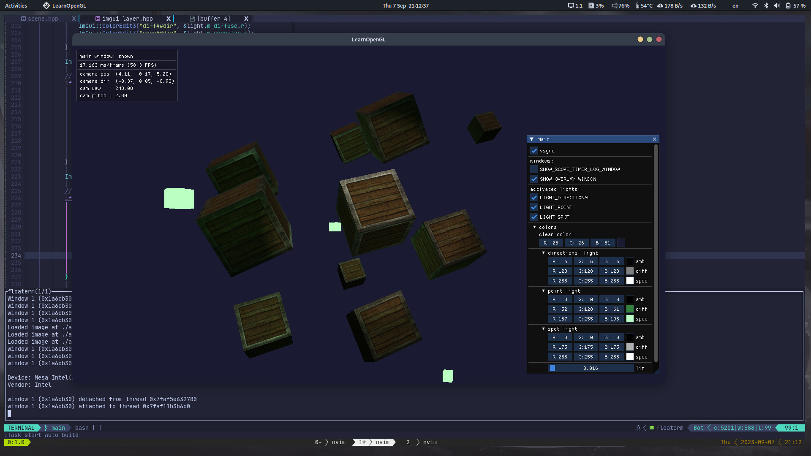

# Multiple Lights

To use more than one light source in the scene, we want to encapsulate the lighting calculations into GLSL functions. The reason is that the code quickly gets nasty when do lighting computations with multiple light types, each requiring different computations.

Functions in GLSL are just C-like functions. We have a functions name, a return type and we need to declare a prototype at the top of the code file if the function hasn't been declared yet before the main function. We'll create a different function for each of the light types: directional lights, point lights, and spotlights.

When using multiple lights in a scene the approach is usually as follows:

- We have a single color vector that represents the fragment's output color.
- for each light, the light's contribution to the fragment is added to this output color vector.
- So each light in the scene will calculate its individual impact and contribute that to the final output color.
  A general structure would look something like this:

```glsl
out vec4 FragColor;

void main()
{
    // define an output color value
    vec3 output = vec3(0.0);

    // add the directional light's conribution to the output
    output += someFunctionToCalculateDirectionalLight();

    // do the same for all point lights
    for (int i = 0; i < nr_of_point_lights; ++i)
        output += someFunctionToCalculatePointLight();

    // and add others lights as well (like spotlight)
    output += someFunctionsToCalculateSpotLight();

    FragColor = vec4(output, 1.0);
}
```

The actual code will likely differ per implementation, but the general structure remains the same. We define several functions that calculate the impact per light source and add its resulting color to an output color vector.

## Directional light

We want to define a function in the fragment shader that calculates the contribution a directional light has on the correspoindig fragment.

First we need to set the required variables that we minimally need for a directional light source. We can store the variables in a struct called `DirLight` and define it as a uniform.

```cpp
struct DirLight
{
    vec3 direction;

    vec3 ambient;
    vec3 diffuse;
    vec3 specular;
};
```

We can then create a function that calculate directional light

```glsl
vec3 calcDirLight(DirLight light, vec3 normal, vec3 viewDir)
{
    vec3 lightDir = normalize(-light.direction);

    // diffuse shading
    float diff = max(dot(normal, lightDir), 0.0);

    // specular shading
    vec3 reflectDir = reflect(-lightDir, normal);
    float spec = pow(max(dot(viewDir, reflectDir), 0.0), material.shininess);

    // combine results
    vec3 ambient = light.ambient * texture(material.diffuse, TexCoords).xyz;
    vec3 diffuse = light.diffuse * diff * texture(material.diffuse, TexCoords).xyz;
    vec3 specular = light.specular * spec * texture(material.specular, TexCoords).xyz;

    return (ambient + diffuse + specular);
}
```

## Point light

Similar to directional lights, we also want to define a function that calculates the contribution a point light has on the given fragment, including its attenuation. We define the struct first.

```glsl
// point light source
struct PointLight
{
    vec3 position;

    vec3 ambient;
    vec3 diffuse;
    vec3 specular;

    float constant;
    float linear;
    float quadratic;
};
#define NR_POINT_LIGHTS 4                           // define the number of point lights we want to have in our scene
uniform PointLight pointLights[NR_POINT_LIGHTS];    // an array of point light
```

Notice that we can have multiple point light in our scene. Here, we represent that with a fixed array of `PointLight` with length `NR_POINT_LIGHTS`.

> GLSL does not allow varying size of array ([source](https://stackoverflow.com/a/37335966/16506263))

The function implementation should be similar to [previous chapter](../2.5_light_casters/notes.md) implementation

Setting the uniform values of an array of structs works like setting the uniforms of a single struct, in addition to that we need to define the appropriate index when querying the uniform's location.

```cpp
lightingShader.setFloat("pointLights[0].constant", 1.0f);
```

## Spotlight

The implementation also should be similar to [previous chapter](../2.5_light_casters/notes.md) implementation

## Putting it all together

Put all to the main() function

```glsl
void main()
{
    // putting it all together
    //------------------------
    // properties
    vec3 norm = normalize(Normal);
    vec3 viewDir = normalize(viewPos - FragPos);

    vec3 result;

    // directional lighting
    result = calcDirLight(dirLight, norm, viewDir);

    // point lights
    for (int i = 0; i < NR_POINT_LIGHTS; ++i)
        result += calcPointLight(pointLights[i], norm, FragPos, viewDir);

    // spotlight
    result += calcSpotLight(spotLight, norm, FragPos, viewDir);

    FragColor = vec4(result, 1.0);
    //------------------------
}
```

Each light type adds its contribution to the resulting output color until all light sources are processed. The resulting color contains the color impact of all the light sources in the scene combined.

After that, we just need to set the uniforms inside our application.

## Result


