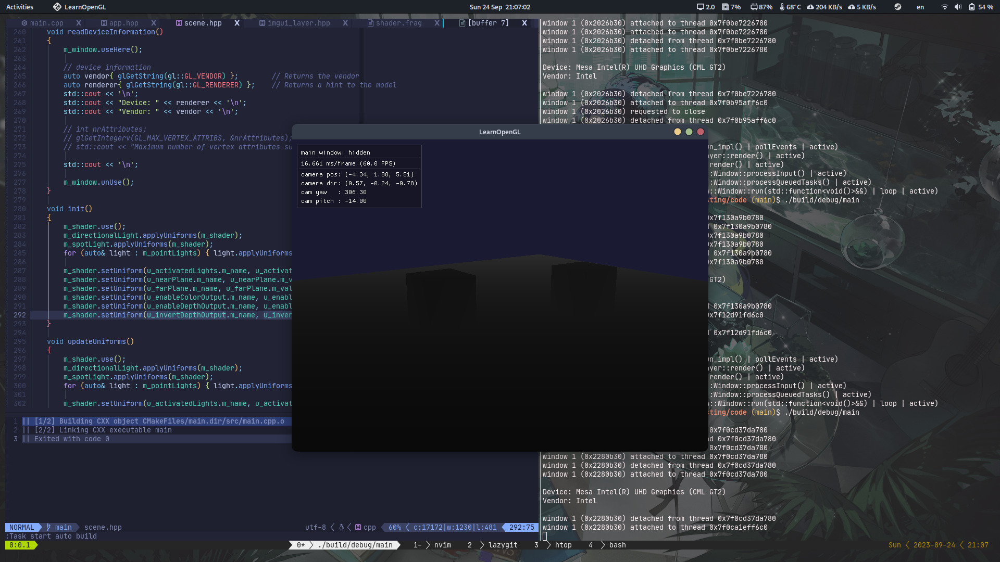
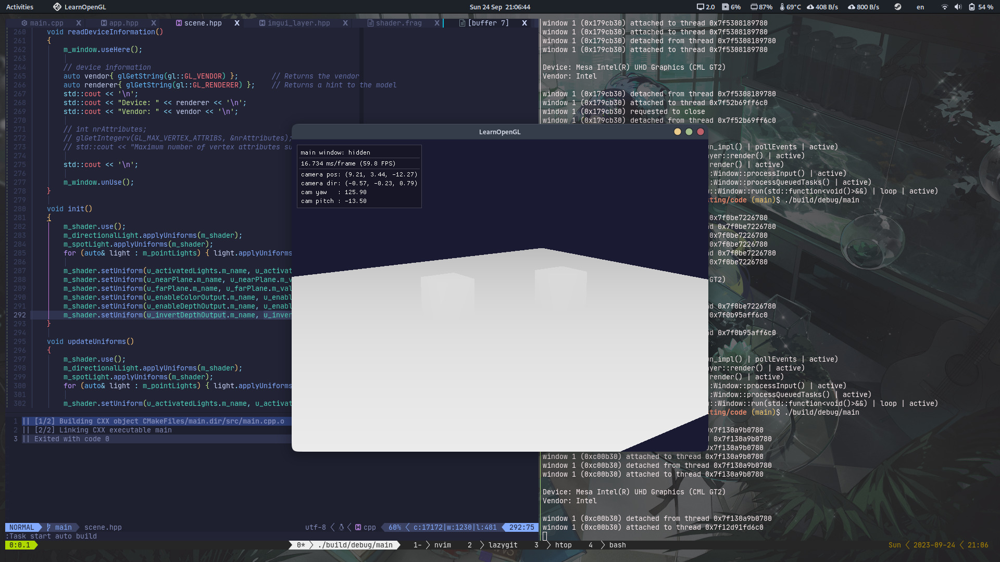

# Depth Testing

In depth testing, we use the term **depth buffer**. The **depth buffer** is a buffer that just like the color buffer, stores information per fragment and has the same width and height as the color buffer. The depth buffer is automatically created by the windowing system and stores its depth values as 16, 24, or 32 bit floats. In most systems you'll see a depth buffer with a precision of 24 bits.

When depth testing is enabled, OpenGL tests the depth value of a **fragment** against the content of the **depth buffer**. OpenGL performs a depth test and if this test passes, the fragment is rendered and the depth buffer is updated with the new depth value. If the depth test fails, the fragment is discarded.

Depth testing is done in screen space after the fragment shader has run (and after the stencil test (next chapter)). The screen space coordinates relate directly to the viewport defined by OpenGL's `glViewport` function and can be accessed via GLSL's built-in **`gl_FragCoord`** variable in the fragment shader. The $x$ and $y$ components of `gl_FragCoord` represent the fragment's screen-space coordinates ($0,0$ at bottom-left), and the $z$ component which contains the depth value of the fragment.

Depth testing is disabled by default, enable it with the `GL_DEPTH_TEST` enum value.

```cpp
glEnable(GL_DEPTH_TEST);
```

You should also clear the depth buffer before each frame using `GL_DEPTH_BUFFER_BIT` enum value.

```cpp
glClear(GL_DEPTH_BUFFER_BIT | <other_buffer_bit> | ... );
```

There are certain scenarios where you want to perform the depth test on all fragment and discard them accordingly, but not update the depth buffer. OpenGL allows us to disable writing to the depth buffer by setting its depth mask to `GL_FALSE`.

```cpp
glDepthMask(GL_FALSE);
```

## Depth test function

OpenGL allows us to modify the comparison operations it uses for the depth test. This allows us to control when OpenGL should pass or discard fragments and when to update the depth buffer. We can set the comparison operator (or depth function) by calling `glDepthFunc`.

```cpp
glDepthFunc(<depth_function>);
```

Depth functions

| Type          | Description                                                  |
| ------------- | ------------------------------------------------------------ |
| `GL_ALWAYS`   | the depth test always passes                                 |
| `GL_NEVER`    | the depth test never passes                                  |
| `GL_LESS`     | passes if the fragment's depth value `< ` stored depth value |
| `GL_EQUAL`    | passes if the fragment's depth value `==` stored depth value |
| `GL_LEQUAL`   | passes if the fragment's depth value `<=` stored depth value |
| `GL_GREATER`  | passes if the fragment's depth value `> ` stored depth value |
| `GL_NOTEQUAL` | passes if the fragment's depth value `!=` stored depth value |
| `GL_GEQUAL`   | passes if the fragment's depth value `>=` stored depth value |

By default, the depth function `GL_LESS` is used.

## Depth value precision

The depth buffer contains depth values between $0.0$ and $1.0$ and it compares its contents with the $z$-values for all the objects in the scene as seen from the viewer. These $z$-values in view space can be any value between the projection-frustum's $near$ and $far$ plane. We need some way to transform these view-space $z$-values from $[near, far]$ to $[0, 1]$. One way is to linearly transform it.

$F_{depth} = \dfrac {z - near} {far - near}$

> Note that all equations give a depth value close to $0.0$ when the object is close by and a depth value close to $1.0$ when the object is close to the $far$ plane.

In practice, a linear depth buffer like this is almost never used. Because of projection properties a non-linear depth equation is used that is proportional to $1/z$. The result is that we got enormous precision when $z$ is small and much less precision when $z$ is far away.

$F_{depth} = \dfrac {1/z - 1/near} {1/far - 1/near}$

The important thing to remember is that the values in the depth buffer are not linear in clip-space (they are linear in view-space before the projection matrix is applied).

The equation to transform $z$-values (from the viewer's perspective) is embedded within the projection matrix so when we transform vertex coordinates from view to clip, and then to screen-space, the non-linear equation is applied.

## Visualizing the depth buffer

We know that the z-value of the built-in `gl_FragCoord` vector in the fragment shader contains the depth value of that particular fragment. If we were to output this depth value of the fragment as a color, we could display the depth values of all the fragments in the scene.

```glsl
void main()
{
    FragColor = vec4(gl_FragCoord.zzz, 1.0);
}
```

The above z-values are non-lienear. We can transform the non-linear depth values of the fragment back to its linearity. To achieve this, we need to reverse the process of projection for the depth values:

- Re-transform the depth values from the range $[0,1]$ to NDC in range $[-1,1]$
- Reverse the non-linear equation from above (previous section; $1/z$ equation) as done in the projection matrix and apply this inversed equation to the resulting depth value

$F_{linear\ depth} = \dfrac {2 \cdot near \cdot far} { far + near - ndc \cdot (far - near)}$

> ndc = depth value that has been transformed from $[0,1]$ to $[-1,1]$

```glsl
    float ndc = depth * 2.0 - 1.0;
    float linearDepth = (2.0 * near * far) / (far + near - ndc * (far - near));
```

> For more detail, read this [article](https://www.songho.ca/opengl/gl_projectionmatrix.html)

## Z-fighting

A common visual artifact may occur when two planes or triangles are so closely aligned to each other that the depth buffer does not have enough precision to figure out which one of the two shapes is in front of the other. The result is that the two shapes continually seem to switch order which causes weird glitchy patterns. This is called **z-fighting**.

Z-fighting can't be completely prevented, but there are a few tricks that will help to mitigate or completely prevent z-fighting in your scene.

### Prevent z-fighting

- Never place objects too close to each other in a way that some of their triangles closely overlap.
- Set the near plane as far as possible.
- Use a higher precision depth buffer (at the cost of some performance).
- others.

## Result



