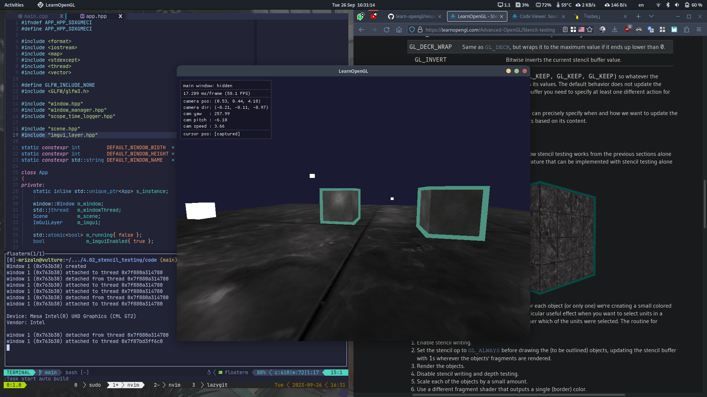
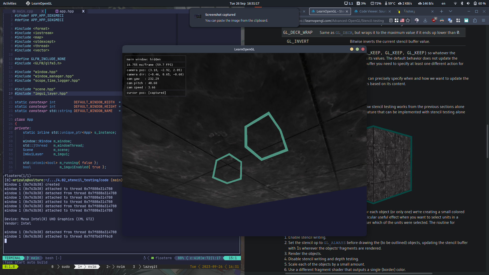

# Stencil Testing

Once the fragment shader has processed the fragment, a **stencil test** is executed. After that, the remaining fragments are passed to the depth test. The stencil test is based on a **stencil buffer** that we're allowed to update during rendering.

A stencil buffer (usually) contains 8 bits per **stencil value**. We can set these stencil values to our liking to discard or keep fragments whenever a particular fragment has a certain stencil value.

> Each windowing library needs to set up a stencil buffer for you. GLFW does this automatically.

By changing the content of the stencil buffer while we're rendring, we're writing to the stencil buffer. In the same (or following) frame(s) we can read these values to discard or pass certain fragments. The outline of doing this is as follows:

- Enable writing to the stencil buffer.
- Render objects, updating the content of the stencil buffer.
- Disable writing to the stencil buffer.
- Render (other) objects, this time discarding certain fragments based on the content of the stencil buffer.

By using the stencil buffer we can thus discard certain fragments based on the fragments of other drawn objects in the scene.

To enable stencil test (all rendering calls from that point will influence the stencil buffer):

```cpp
glEnable(GL_STENCIL_TEST);
```

Don't forget to clear the stencil buffer each iteration.

```cpp
glClear(GL_COLOR_BUFFER_BIT | GL_DEPTH_BUFFER_BIT | GL_STENCIL_BUFFER_BIT);
```

The function `glStencilMask` allows us to set a bitmask that is `AND`ed with the stencil value about to be written to the buffer. By default this is set to a bitmask of all $1$s not affecting the output, but if we're to set this to $0x00$ all the stencil values written to the buffer end up as $0$s. This is equivalent to `glDepthMask(GL_FALSE)`.

```cpp
glStencilMask(0xFF);    // each bit is written as is
glStencilMask(0x00);    // each bit end up as 0 in the stencil buffer
```

## Stencil functions

There are a total of two function we can use to configure stencil testing:

- `glStencilFunc(GLenum func, GLint ref, GLuint mask)`: describes whether OpenGL should pass or discard fragments based on the stencil buffer's content.

  - `func`: sets the stencil test function that determines whether a fragment passes or is discarded.
    - `GL_NEVER`
    - `GL_LESS`
    - `GL_LEQUAL`
    - `GL_GREATER`
    - `GL_GEQUAL`
    - `GL_EQUAL`
    - `GL_NOTEQUAL`
    - `GL_ALWAYS`
  - `ref`: specifies the reference value for the stencil test (the stencil buffer's content is compared to this value).
  - `mask`: specifies a mask that is `AND`ed with both the reference value and the stored stencil value before the test compares them (default to all $1$s).

<br>

- `glStencilOp(GLenum sfail, GLenum dpfail, GLenum dppass)`: describes how we actually update the buffer.

  - `sfail`: action to take if the stencil test fails.
  - `dpfail`: action to take if the stencil test passes but the depth test fails.
  - `dppass`: action to take if the stencil and depth test pass.

  <br>

  Possible values of actions

  | Action         | Description                                               |
  | -------------- | --------------------------------------------------------- |
  | `GL_KEEP`      | keep current value                                        |
  | `GL_ZERO`      | set the value to 0                                        |
  | `GL_REPLACE`   | replace with the reference value set with `glStencilFunc` |
  | `GL_INCR`      | increment the current value if not max already            |
  | `GL_INCR_WRAP` | increment then wrap if max                                |
  | `GL_DECR`      | decrement the current value if not min already            |
  | `GL_DECR_WRAP` | decrement then wrap if min                                |
  | `GL_INVERT`    | bitwise invert the current value                          |

## Object outlining



