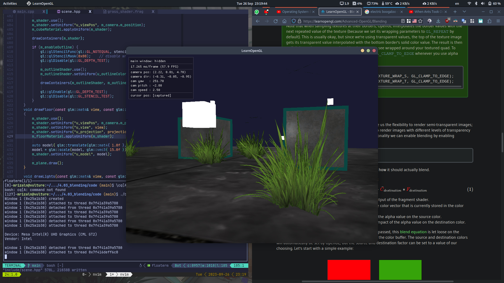
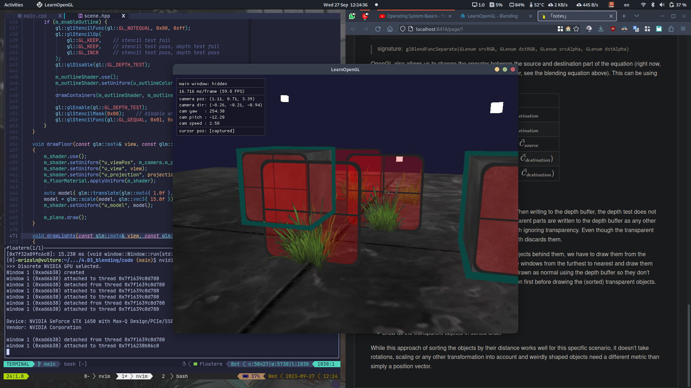

# Blending

Blending in OpenGL is commonly known as the technique to implement **transparency** within objects. Transparent objects can be completely transparent or partially transparent (let some colors through, but also some of its own colors) that is defined by its color's **alpha** value. The alpha of a color is the 4th component of a color vector.

> An alpha value of $1.0$ will give an opaque color, and an alpha value of $0.0$ will completely transparent.

## Discarding fragments

GLSL gives us the `discard` command that ensures the fragment will not be further processed and thus not end up into the color buffer.

```glsl
#version 330 core

out vec4 FragColor;

in vec2 TexCoords;

uniform sampler2D texture1;

void main()
{
    vec4 texColor = texture(texture1, TexCoords);
    if (texColor.a < 0.1)
        discard;                  // discard fragment if alpha value is less than 0.1
    FragColor = texColor;
}
```

### Result discarding fragment



> Using a [texture](./code/assets/texture/grass.png) that contains transparency (alpha channel to discard) to draw grass.

## Blending

While discarding fragments is great and all, it doesn't give us the flexibility to render semi-transparent images. To render images with different levels of transparency, we have to enable **blending**.

```cpp
glEnable(GL_BLEND);
```

Blending in OpenGL happens with the following equation

$$
{\color {white} \vec C_{result}} = {\color {green} \vec C_{source}} \odot {\color {green} \vec F_{source}} + {\color {magenta} \vec C_{destination}} \odot {\color {magenta} \vec F_{destination}}
$$

- ${\color {green} \vec C_{source}}$: the source color vector; the color output of the fragment shader
- ${\color {green} \vec F_{source}}$: the source factor value; sets the impact of the alpha value on the source color
- ${\color {magenta} \vec C_{destination}}$: the destination color vector; the color vector that is currently stored in the color buffer
- ${\color {magenta} \vec F_{destination}}$: the destination factor value; sets the impact of the alpha value on the destination color

After the fragment shader has run and all the tests have passed, this blend equation is let loose on the fragment's color output and with whatever is currently in the color buffer. The source and destination colors will automatically be set by OpenGL, but the source and destination factor can be set to a value of our choosing.

Using `glBlendFunc` we can tell OpenGL how to use the factors in the blending process.

The `glBlendFunc(GLenum sfactor, GLenum dfactor)` function expects two parameters that set the option for the **source** and the **destination** factor.

| Option                        | Value                                     |
| ----------------------------- | ----------------------------------------- |
| `GL_ZERO`                     | $0$                                       |
| `GL_ONE`                      | $1$                                       |
| `GL_SRC_COLOR`                | $\vec C_{source}$                         |
| `GL_ONE_MINUS_SRC_COLOR`      | $1 - \vec C_{source}$                     |
| `GL_DST_COLOR`                | $\vec C_{destination}$                    |
| `GL_ONE_MINUS_DST_COLOR`      | $1 - \vec C_{source}$                     |
| `GL_SRC_ALPHA`                | $c_{source,\ alpha}$                      |
| `GL_ONE_MINUS_SRC_ALPHA`      | $1 - c_{source,\ alpha}$                  |
| `GL_DST_ALPHA`                | $c_{destination,\ alpha}$                 |
| `GL_ONE_MINUS_DST_ALPHA`      | $1 - c_{destination,\ alpha}$             |
| `GL_CONSTANT_COLOR`           | $\vec C_{constant}$ <sup>\*)</sup>        |
| `GL_ONE_MINUS_CONSTANT_COLOR` | $1 - \vec C_{constant}$<sup>\*)</sup>     |
| `GL_CONSTANT_ALPHA`           | $c_{constant,\ alpha}$ <sup>\*)</sup>     |
| `GL_ONE_MINUS_CONSTANT_ALPHA` | $1 - c_{constant,\ alpha}$ <sup>\*)</sup> |

> \*) $\vec C_{constant}$ can be separately set via `glBlendColor` function

Example usage

```cpp
glBlendFunc(GL_SRC_ALPHA, GL_ONE_MINUS_SRC_ALPHA);
```

> This is equivalent to ${\color {white} \vec C_{result}} = {\color {green} \vec C_{source}} \cdot {\color {green} c_{source,\ alpha}} + {\color {magenta} \vec C_{destination}} \cdot {\color {magenta} (1 - c_{source,\ alpha})}$

It is also possible to set different options for the RGB and alpha channel individually using `glBlendFuncSeparate`

```cpp
glBlendFuncSeparate(GL_SRC_ALPHA, GL_ONE_MINUS_SRC_ALPHA, GL_ONE, GL_ZERO);
```

> signature: `glBlendFuncSeparate(GLenum srcRGB, GLenum dstRGB, GLenum srcAlpha, GLenum dstAlpha)`

OpenGL also allows us to change the operator between the source and destination part of the equation (right now, the source and destination components are added together, see the blending equation above). This can be using `glBlendEquation(GLenum mode)` function

| Option                     | Operation                                                       |
| -------------------------- | --------------------------------------------------------------- |
| `GL_FUNC_ADD`              | $\vec C_{result} = \vec C_{source} + \vec C_{destination}$      |
| `GL_FUNC_SUBTRACT`         | $\vec C_{result} = \vec C_{source} - \vec C_{destination}$      |
| `GL_FUNC_REVERSE_SUBTRACT` | $\vec C_{result} = \vec C_{destination} - \vec C_{source}$      |
| `GL_MIN`                   | $\vec C_{result} = min(\vec C_{source},\ \vec C_{destination})$ |
| `GL_MAX`                   | $\vec C_{result} = max(\vec C_{source},\ \vec C_{destination})$ |

### Rendering semi-transparent texture

Depth testing works a bit tricky combined with blending. When writing to the depth buffer, the depth test does not care if the fragment has transparency or not, so the transparent parts are written to the depth buffer as any other value. The result is that the background are tested on depth ignoring transparency. Even though the transparent part should show any transparent object behind it, the depth discards them.

To make sure the transparent object shows transparent objects behind them, we have to draw them from the background first. This means we have to manually sort the windows from the furthest to nearest and draw them accordingly. The normal non-blended objects can still be drawn as normal using the depth buffer so they don't have to be sorted. We do have to make sure they are drawn first before drawing the (sorted) transparent objects.

The general outline is usually as follows

- Draw all opaque objects first
- Sort all the transparent objects
- Draw all the transparent objects in sorted order



While this approach of sorting the objects by their distance works well for this specific scenario, it doesn't take rotations, scaling or any other transformation into account and weirdly shaped objects need a different metric than simply a position vector.

There are more advanced techniques like **[order independent transparency](https://en.wikipedia.org/wiki/Order-independent_transparency)** that can solve this ordering problem.
