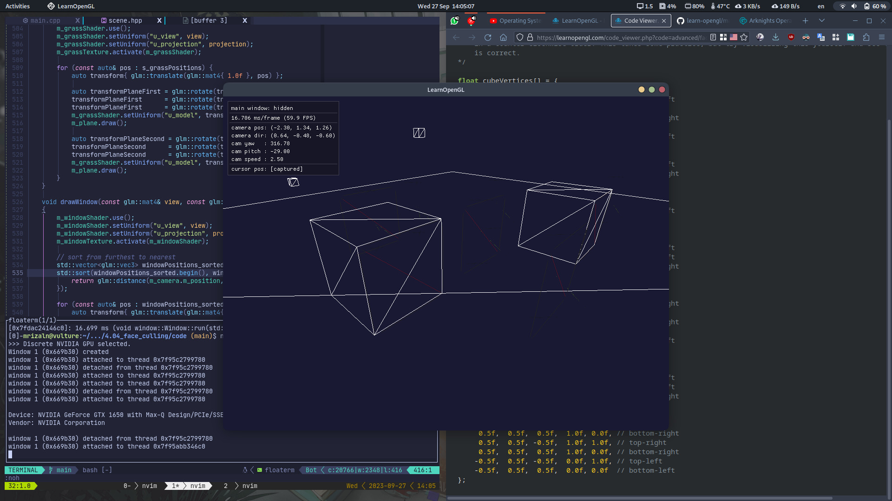
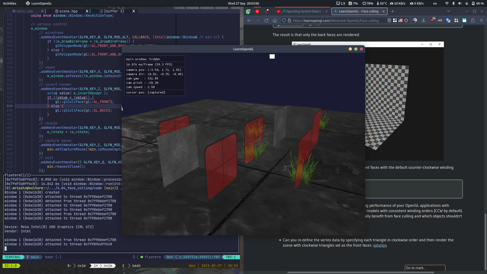

# Face Culling

Face culling done in OpenGL by checking all the faces that are **front facing** towards the viewer and renders those while discarding all the faces that are **back facing**, saving a lot of fragment shader calls. We need to tell OpenGL which of the faces we use are actually the front faces and which faces are the back faces. OpenGL uses a clever trick for this by analyzing the **winding order** of the vertex data.

## Winding order

WHen we define a set of triangle vertices, we're defining them in a certain winding order that is either **clockwise** or **counter-clockwise**. Each triangle consists of 3 vertices and we specify those 3 vertices in a winding order as seen from the center of the triangle. OpenGL uses this information when rendering your primitives to determine if a triangle is a **front-facing** or a **back-facing** triangle.

> By default, triangles define with **counter-clockwise** vertices are processed as front-facing triangles.

## Face culling

To enable face culling, we only have to enable OpenGL's `GL_CULL_FACE` option

> This option is disabled by default

```cpp
glEnable(GL_CULL_FACE);
```

OpenGL allows us to change the type of face we want to cull as well. What if we want to cull front faces and not the back faces? We can define this behavior with `glCullFace`.

```cpp
glCullFace(GL_FRONT);
```

Possible options

- `GL_BACK`: culls only the back faces
- `GL_FRONT`: culls only the front faces
- `GL_FRONT_AND_BACK`: culls both the front and back faces

> The default is `GL_BACK`

We can also tell OpenGL we'd rather prefer clockwise faces as the front-faces instead of counter-clockwise faces via `glFrontFace`

```cpp
glFrontFace(GL_CCW);    // default value; the other value is `GL_CW`
```

As a simple test, we could reverse the winding order by telling OpenGL that the front-faces are now determined by a clockwise ordering instead of a counter-clockwise ordering.

> First way

```cpp
glEnable(GL_CULL_FACE);
glCullFace(GL_BACK);
glFrontFace(GL_CW);
```

> Second way

```cpp
glEnable(GL_CULL_FACE);
glCullFace(GL_FRONT);
glFrontFace(GL_CCW);
```

<br>



> Wireframe view

<br>



> Reverse culling
