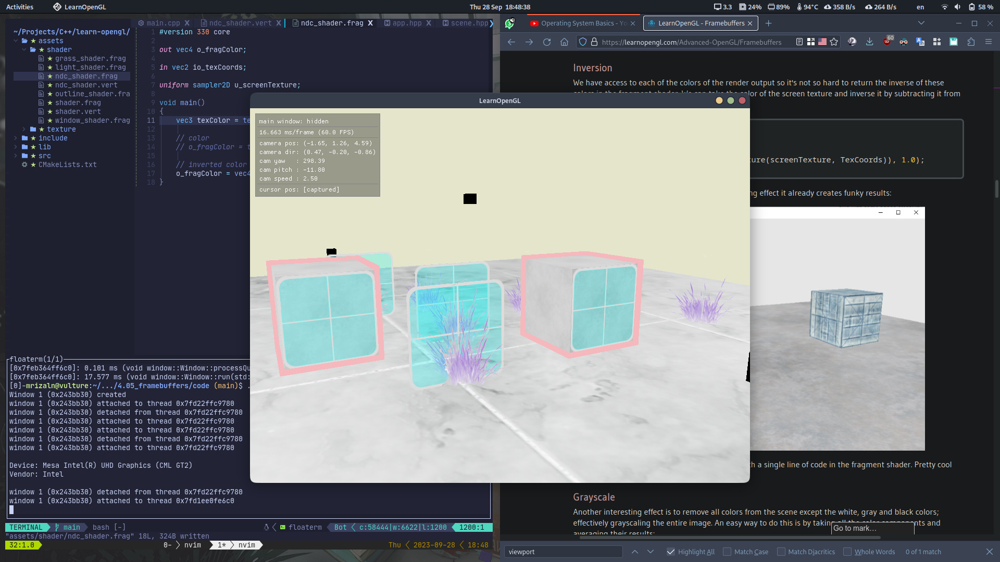
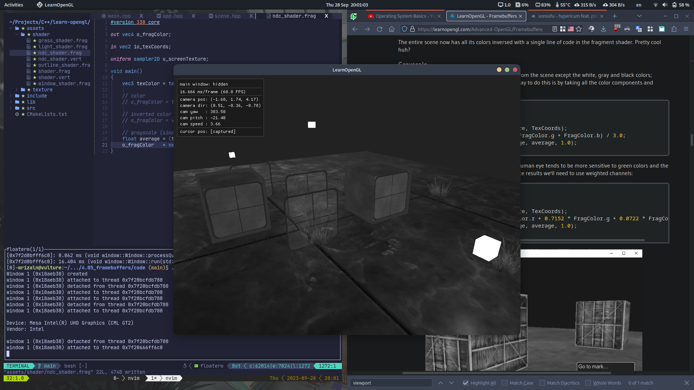
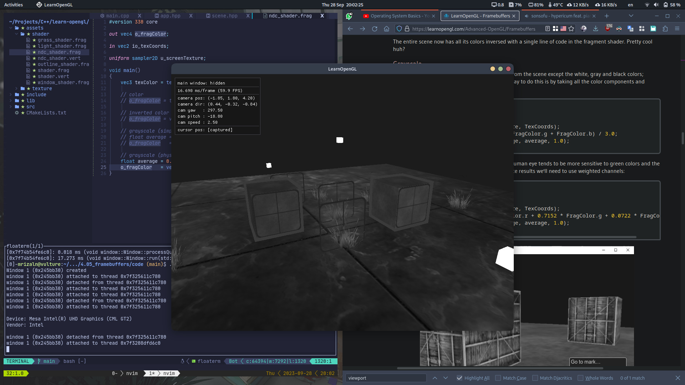
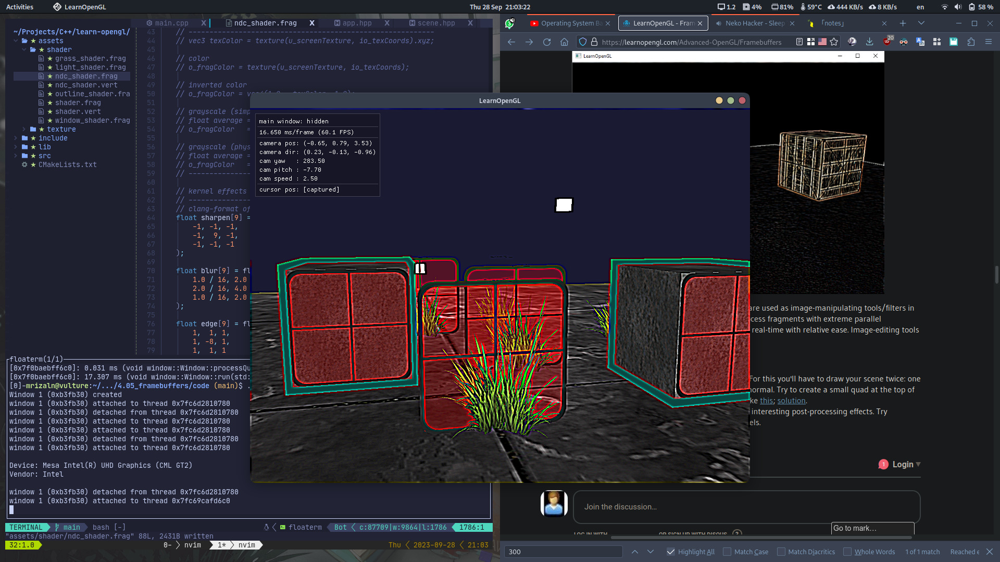
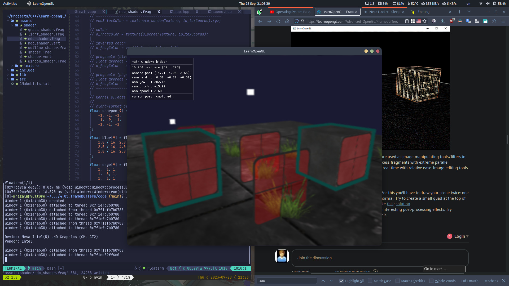
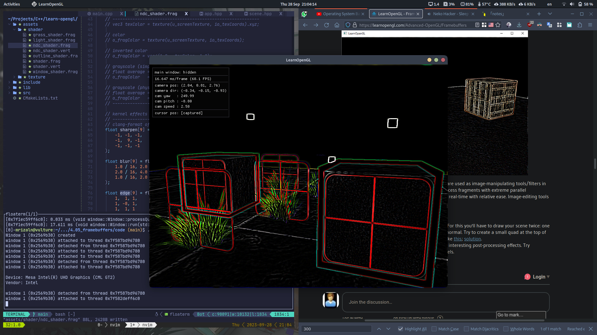

# Framebuffers

**Framebuffer** is the combination of of all the buffers we have discussed before: **color buffer**, **depth buffer**, and **stencil buffer** stored in GPU memory. OpenGL gives us the flexibility to define our own framebuffers and thus define our own color (and optionally a depth and stencil) buffer.

The rendering operations we've done so far were all done on top of the render buffers attached to the **default framebuffer**. The default framebuffer is created and configured when you create your own window (GLFW does this for us). By creating our own frramebuffer, we can get an additional target to render to.

## Creating a framebuffer

We can create a framebuffer object (FBO) by using a function called `glGenFramebuffers`

```cpp
gl::GLuint fbo;
glGenFramebuffers(1, &fbo);
```

The usage is similar to any other buffer object. To bind the framebuffer, we use `glBindFramebuffer`

```cpp
glBindFramebuffer(GL_FRAMEBUFFER, fbo);
```

By binding to the `GL_FRAMEBUFFER` target, all the next _read_ and _write_ framebuffer operations will affect the currently bound framebuffer. It is also possible to bind a framebuffer to a read or write target specially by binding to `GL_READ_FRAMEBUFFER` or `GL_DRAW_FRAMEBUFFER` respectively. The framebuffer bound to `GL_READ_FRAMEBUFFER` is then used for all read operations like `glReadPixels` and the framebuffer bound to `GL_DRAW_FRAMEBUFFER` is used as the destination for rendering, clearing, and other write operations.

At this point, our framebuffer is not **complete** (we can't use it). For a framebuffer to be complete, the following requirements have to be satisfied:

- We have to attach at least one buffer (color, depth, or stencil).
- There should be at least one color attachment.
- All attachments should be complete as well (reserved memory).
- Each buffer should have the same number of samples.

> An attachment is a memory location that can act as buffer for the framebuffer. When creating an attachment, we have two options: textures or **renderbuffer** objects.

After we've completed all requirements, we can check if we actually successfully completed the framebuffer by calling `glCheckFramebufferStatus` with `GL_FRAMEBUFFER`. If the return value is `GL_FRAMEBUFFER_COMPLETE` we're good to go.

> All of the possible return values are defined [here](https://registry.khronos.org/OpenGL-Refpages/gl4/html/glCheckFramebufferStatus.xhtml)

```cpp
if (glCheckFramebufferStatus(GL_FRAMEBUFFER) == GL_FRAMEBUFFER_COMPLETE) {
    // do something with the framebuffer
}
```

Since our framebuffer is not the default framebuffer, the rendering commands will have no impact on the visual output of our window. For this reason, it is called **off-screen rendering** when rendering to a different framebuffer. If you want all rendering operations to have a visual impact again on the main window, we need to make the default framebuffer active by binding to $0$.

```cpp
glBindFramebuffer(GL_FRAMEBUFFER, 0);
```

As always, when we're done with all framebuffer operations, do not forget to delete the object.

```cpp
glDeleteFramebuffers(1, &fbo);
```

### Texture attachments

When attaching a texture to a framebuffer, all rendering commands will write to the texture as if it was a normal color/depth or stencil buffer. The advantage of using textures is that the render output is stored inside the texture image that we can then easily use in our shaders.

Creating a texture for a framebuffer is roughly the same as creating a normal texture.

```cpp
gl::GLuint texture;

glGenTextures(1, &texture);
glBindTexture(GL_TEXTURE_2D, texture);

glTexImage2D(GL_TEXTURE_2D, 0, GL_RGB, 800, 600, 0, GL_RGB, GL_UNSIGNED_BYTE, nullptr);

glTexParameteri(GL_TEXTURE_2D, GL_TEXTURE_MIN_FILTER, GL_LINEAR);
glTexParameteri(GL_TEXTURE_2D, GL_TEXTURE_MAG_FILTER, GL_LINEAR);
```

The main differences here is that we set the dimensions equal to the screen size (although not required), and we pass `nullptr` as the texture's `data` parameter. For this texture, we're only allocating memory and not actually filling it. Filling the texture will happen as soon as we render to the framebuffer.

> If you want to render your whole screen to a texture of a smaller or larget size, you need to call `glViewPort` agan (before rendering to your framebuffer) with the new dimension of your texture, otherwise render commands will only fill part of the texture.

Now we can attach the texture to the framebuffer.

```cpp
glFrameBufferTexture2D(GL_FRAMEBUFFER, GL_COLOR_ATTACHMENT0, GL_TEXTURE_2D, texture, 0);
```

Function signature: `glFrameBufferTexture2D(GLenum target, GLenum attachment, GLenum textarget, GLuint texture, GLint level)`

- `target`: framebuffer type (draw, read, or both)

- `attachment`: type of attachment we're going to attach (we can attach more than one color attachment). possible values:

  - `GL_COLOR_ATTACHMENTi` (where `i` is an integer >= 0)
  - `GL_DEPTH_ATTACHMENT`
    > Texture's **format** and **internalformat** should then become `GL_DEPTH_COMPONENT`
  - `GL_STENCIL_ATTACHMENT`
    > Texture's **format** and **internalformat** should then become `GL_STENCLI_INDEX`
  - `GL_DEPTH_STENCIL_ATTACHMENT`
    > Each 32 bit value of the texture contains 24 bit of depth information and 8 bits of stencil information
    >
    > ```cpp
    > glTexImage2D(
    >     GL_TEXTURE_2D,
    >     0,
    >     GL_DEPTH24_STENCIL8,    // internal format of 24 bits of depth and 8 bits of stencil
    >     800,
    >     600,
    >     0,
    >     GL_DEPTH_STENCIL,       // contains depth and stencil per pixel
    >     GL_UNSIGNED_INT_24_8,   // both depth and stencil is integer (?)
    >     nullptr
    > );
    >
    > glFramebufferTexture2D(GL_FRAMEBUFFER, GL_DEPTH_STENCIL_ATTACHMENT, GL_TEXTURE_2D, texture, 0);
    > ```

- `textarget`: type of texture you want to attach

- `level`: mipmap level

### Renderbuffer objects attachments

**Renderbuffer objects** (RBO) were introduced to OpenGL after textures as a possible type of framebuffer attachment. A renderbuffer object is an actual buffer (like texture). However, a renderbuffer object can not be directly read from (has performance edge over textures for off-screen rendering).

Renderbuffer objects store all the render data directly into their buffer without any conversion to texture-specific formats. You cannot directly read from the,, but it is possible to them via `glReadPixels` (albeit slow).

Creating a renderbuffer objects looks similar to the framebuffer's code.

```cpp
GLuint rbo;

glGenRenderbuffers(1, &rbo);
glBindRenderbuffer(GL_RENDERBUFFER, rbo);
```

Since renderbuffer objects are write-only, they are often used as depth and stencil attachments, since most of the time we don't really need to read values from them.

> When we're not sampling from framebuffer, a renderbuffer object is generally preferred.

Creating a depth and stencil renderbuffer object is done by calling the `glRenderbufferStorage` function

```cpp
glRenderbufferStorage(GL_RENDERBUFFER, GL_DEPTH24_STENCIL8, 800, 600);
```

The last thing to do is to actually attach the renderbuffer object

```cpp
glFramebufferRenderbuffer(GL_FRAMEBUFFER, GL_DEPTH_STENCIL_ATTACHMENT, GL_RENDERBUFFER, rbo);
```

## Post-processing

New that the entire scene is rendered to a single texture we can create cool **post-processing** effects by manipulating the scene texture.

### Simple post-processing

#### Inversion

We can achieve color inversion by subtracting the color from $1.0$

```glsl
void main()
{
    FragColor = vec4(vec3(1.0 - texture(screenTexture, TexCoords)), 1.0);
}
```



#### Grayscale

> simple grayscale

```glsl
void main()
{
    FragColor = texture(screenTexture, TexCoords);
    float average = (FragColor.r + FragColor.g + FragColor b) / 3.0;
    FragColor = vec4(vec3(FragColor), 1.0);
}
```



> physically accurate

```glsl
void main()
{
    FragColor = texture(screenTexture, TexCoords);
    float average = 0.2126 * FragColor.r + 0.7152 * FragColor.g + 0.0722 * FragColor.b;
    FragColor = vec4(average, average, average, 1.0);
}
```



### Kernel effects

Other advantage about doing post-processing on a single texture image is that we can sample color values from other parts of the texture not specific to that fragment. We could for example take a small area around the current texture coordinate and sample multiple texture values around the current texture coordinate and sample multiple texture values around the current texture value.

A **kernel** (convolution matrix) is a small matrix-like array of values centered on the current pixel that multiplies surrounding pixel values by its kernel values and adds them all together to form a single value.

> Example of a kernel:
> $\begin {bmatrix} 2 & 2 & 2 \\ 2 & -15 & 2 \\ 2 & 2 & 2 \end {bmatrix}$

> Most kernel sum up to $1$ if you add all the weights together. If they don't add up to $1$ it means that the resulting texture color ends up brighter or darker than the original texture value.

We have to slightly adapt the fragment shader a bit to actually support kernels. For example, if the kernel size is $3x3$, possible modification would be like this:

```glsl
// ...

const float offset = 1.0 / 300.0;   // where this number come from?

vec3 applyKernel(float kernel[9])
{
    vec2 offsets[9] = vec2[](
        vec2(-offset,  offset),     // top-left
        vec2( 0.0f,    offset),     // top-center
        vec2( offset,  offset),     // top-right
        vec2(-offset,  0.0f),       // center-left
        vec2( 0.0f,    0.0f),       // center-center
        vec2( offset,  0.0f),       // center-right
        vec2(-offset, -offset),     // bottom-left
        vec2( 0.0f,   -offset),     // bottom-center
        vec2( offset, -offset)      // bottom-right
    );

    vec3 sampleTex[9];
    for (int i = 0; i < 9; ++i) {
        sampleTex[i] = texture(screenTexture, TexCoords.st + offsets[i]).rgb;
    }

    vec3 color = vec3(0.0);
    for (int i = 0; i < 9; ++i) {
        color += sampleTex[i] * kernel[i];
    }

    return color;
}
// ...
```

#### Sharpen

$$
\begin {bmatrix}
-1 & -1 & -1 \\
-1 &  9 & -1 \\
-1 & -1 & -1
\end {bmatrix}
$$



#### Blur

$$
\begin {bmatrix}
1 & 2 & 1 \\
2 & 4 & 2 \\
1 & 2 & 1
\end {bmatrix} / 16
$$



#### Edge detection

$$
\begin {bmatrix}
1 &  1 & 1 \\
1 & -8 & 1 \\
1 &  1 & 1
\end {bmatrix}
$$


