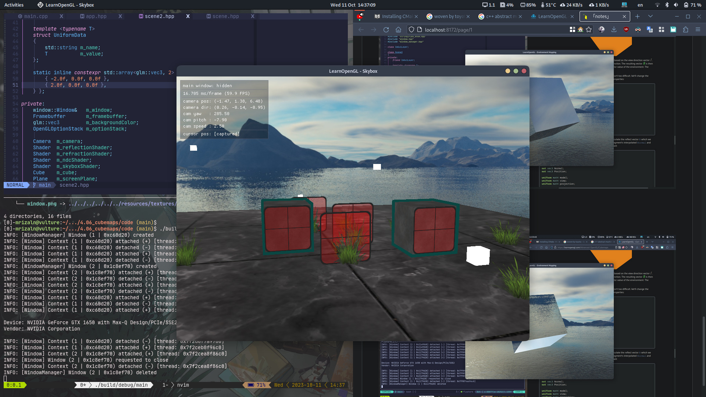
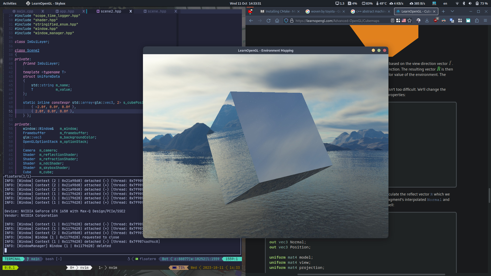
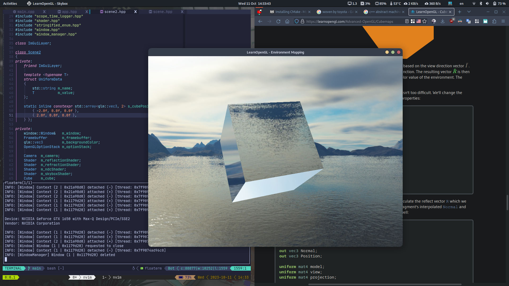

# Cubemaps

A cubemap is a texture that contains 6 individual 2D textures that each form one side of a cube: a textured cube. Cubemaps have useful property that they can be indexed/sampled using a direction vector.

## Creating a cubemap

Cubemap is a texture, so we use the usual function we used to create texture.

```cpp
GLuint textureId;
glGenTexture(1, &textureId);
glBindTexture(GL_TEXTURE_CUBE_MAP, textureId);
```

Because a cubemap contains 6 textures (for each side of a cube), we have to call `glTexImage2D` six times with their parameters set similarly to previous chapters. We have to set the texture **target** parameter to match a specific face of the cubemap.

| Texture target                   | Orientation (left-handed) |
| -------------------------------- | ------------------------- |
| `GL_TEXTURE_CUBE_MAP_POSITIVE_X` | Right                     |
| `GL_TEXTURE_CUBE_MAP_NEGATIVE_X` | Left                      |
| `GL_TEXTURE_CUBE_MAP_POSITIVE_Y` | Top                       |
| `GL_TEXTURE_CUBE_MAP_NEGATIVE_Y` | Bottom                    |
| `GL_TEXTURE_CUBE_MAP_POSITIVE_Z` | Back                      |
| `GL_TEXTURE_CUBE_MAP_NEGATIVE_Z` | Front                     |

> The texture target enumerations is linearly incremented by $1$ from `GL_TEXTURE_CUBE_MAP_POSITIVE_X` to `GL_TEXTURE_CUBE_MAP_NEGATIVE_Z` so you can loop it.

Because a cubemap is a texture like any other texture, we need to specify its wrapping and filtering methods

```cpp
glTexParameteri(GL_TEXTURE_CUBE_MAP, GL_TEXTURE_MAG_FILTER, GL_LINEAR);
glTexParameteri(GL_TEXTURE_CUBE_MAP, GL_TEXTURE_MIN_FILTER, GL_LINEAR);
glTexParameteri(GL_TEXTURE_CUBE_MAP, GL_TEXTURE_WRAP_S, GL_CLAMP_TO_EDGE);
glTexParameteri(GL_TEXTURE_CUBE_MAP, GL_TEXTURE_WRAP_T, GL_CLAMP_TO_EDGE);
glTexParameteri(GL_TEXTURE_CUBE_MAP, GL_TEXTURE_WRAP_R, GL_CLAMP_TO_EDGE);    // 3rd dimension
```

> Cubemap has an additional texture coordinate, $R$, beside $S$ and $T$

Within the fragment shader, we also have to use a different sampler of the type `samplerCube` that we sample from using the `texture` function, but this time using a `vec3` direction vector instead of a `vec2`.

> Example

```glsl
#version 330 core

layout (location = 0) in vec3 aPos;

out vec3 TexCoords;

uniform mat4 projection;
uniform mat4 view;

void main()
{
    TexCoords = aPos;
    gl_Position = projection * view * vec4(aPos, 1.0);
}
```

## Skybox

A cubemap, can be used to create a skybox. A Skybox is a (large) cube that encompasses the entire scene and contains 6 images of a surrounding environment, giving the illusion that the environment is actually larger than it actually is.

A cubemap used to texture a 3D cube can be sampled using the local positions of the cube as its texture coordinates. When a cube is centered on the origin $(0,0,0)$, each of its position vectors is also a direction vector from the origin. This direction vector is what we exactly need to get the corresponding texture value at that specific cube's position. For this reason, we only need to supply position vectors and don't need texture coordinates.

> vertex shader

```glsl
#version 330 core

layout (location = 0) in vec3 aPos;

out vec3 TexCoords;   // 3 dimension texture coordinates

uniform mat4 projection;
uniform mat4 view;

void main()
{
    TexCoords = aPos;   // note: we feed the texture coordinates with position
    gl_Position = projection * view * vec4(aPos, 1.0);    // note: we don't have model matrix here
}
```

> fragment shader

```glsl
#version 330 core

out vec4 FragColor;

in vec3 TexCoords;

uniform samplerCube skybox;   // note: different sampler from on we used for GL_TEXTURE_2D

void main()
{
    FragColor = texture(skybox, TexCoords);
}
```

We want the skybox to be centered around the camera so that nor matter how far the camera moves, the skybox won't get any closer. To do this, we need to remove the translation part from the view matrix by taking the upper-left $3x3$ matrix of the $4x4$ matrix.

```cpp
glm::mat4 view{ glm::mat3{ camera.getViewMatrix() } };
```

### An optimization

Right now we can only render the skybox first, before we rendered all the other objects in the scene since the cube has low depth value. This approach is inefficient though, since the skybox will be drawn for all the fragment on the window even though only small part of it will be visible in the end (obstructed by other rendered objects). We can do an **early depth testing** on the skybox to get some performance boost.

Since the skybox is the furthest "object" in a scene, we can set the depth value of the skybox fragments to the highest value, $1.0$. To do that, we need to consider _perspective division_. Perspective division is performed after the vertex shader has run, dividing the `gl_Position`'s $xyz$ coordinates by its $w$ component. The $z$ value of the resulting division is the depth value. So, to set the depth value to $1.0$ for all fragment, we can set the $z$ value of `gl_Position` to $w$.

```glsl
void main()
{
    TexCoords = aPos;
    vec4 pos = projection * view * vec4(aPos, 1.0);
    gl_Position = pos.xyww;   // the resulting depth value will always have the value of $1.0$
}
```



## Environment mapping

We now have the entire surrounding environment mapped in a single texture object, we could use that information for more than just a skybox. Using a cubemap with an environment, we could give objects relective or refractive properties. Techniques that use an environment cubemap like this are called **environment mapping** techniques.

### Reflection



> [fragment shader](./code/assets/shader/reflection.frag)

### Refraction



> [fragment shader](./code/assets/shader/refraction.frag)
